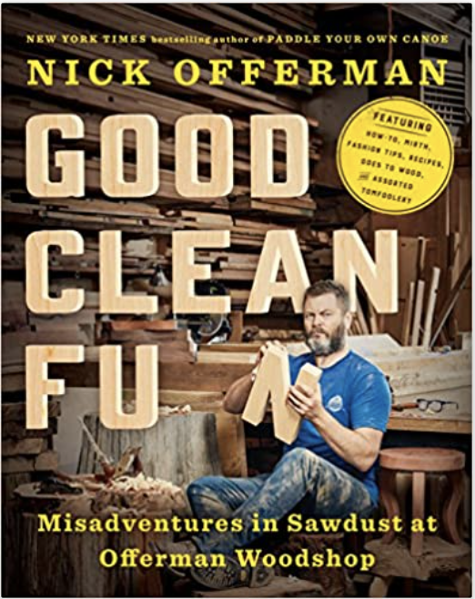

Welcome Reader!

My name is Harper Trow. Here you will find some stories from my forays into the world of woodworking. I hope you find a few stories here that will speak to you, to invite you to make things with your hands. Even if you already have some experience, I hope you will find a few new tricks for your bag.

My path into woodworking started several years back in the Winter of 2016 with a certain type of itch. I make software for a living, working in the ethereal, conceptual world of bits all day. While this practice involves a lovely mix of creativity and logical thinking, if you take a step back and look at it a certain way, all that I really produce at the of the day are a bunch of bits floating around the internet. The work results in pride for a job well done just as much as any other trade, but there was a missing balance with the world of the concrete.

_**I began searching for a way to make things with my hands that resulted in outcomes that were more tangible. A kind of work that produced atoms, not bits.**_

I had enjoyed woodworking with my father when I was younger, helping him with a few projects, and it always stuck in my head as something I might want to get into one day. I just needed a space.

It was in this state of mind that I was given [a book by Nick Offerman called Good Clean Fun](https://www.amazon.com/Good-Clean-Fun-Misadventures-Offerman/dp/1101984651).

It is a playful tome that exudes an obvious love for the craft and has served as a fun and thoughtful on-ramp into the art of woodworking. I cannot recommend this book highly enough. It is definately worth a read. Before long, I found myself dreaming of a future shop space and working on a huge list of projects that I wanted to do.

I found a group of Youtubers that have super high quality woodworking videos, pulled together a couple of other books, and my education began.
