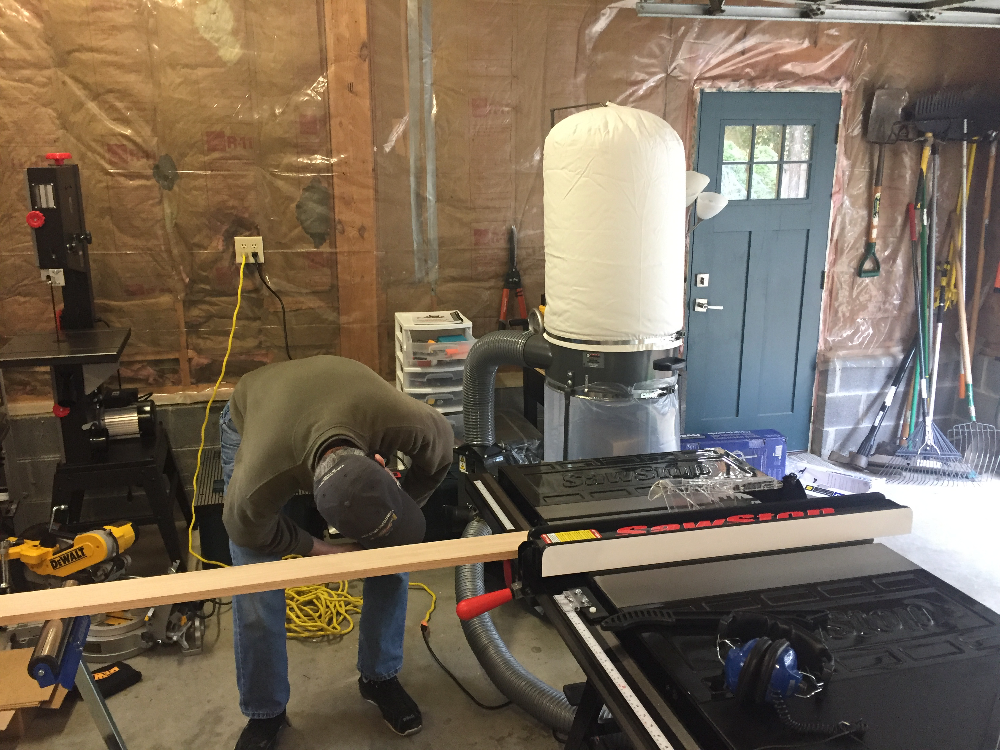
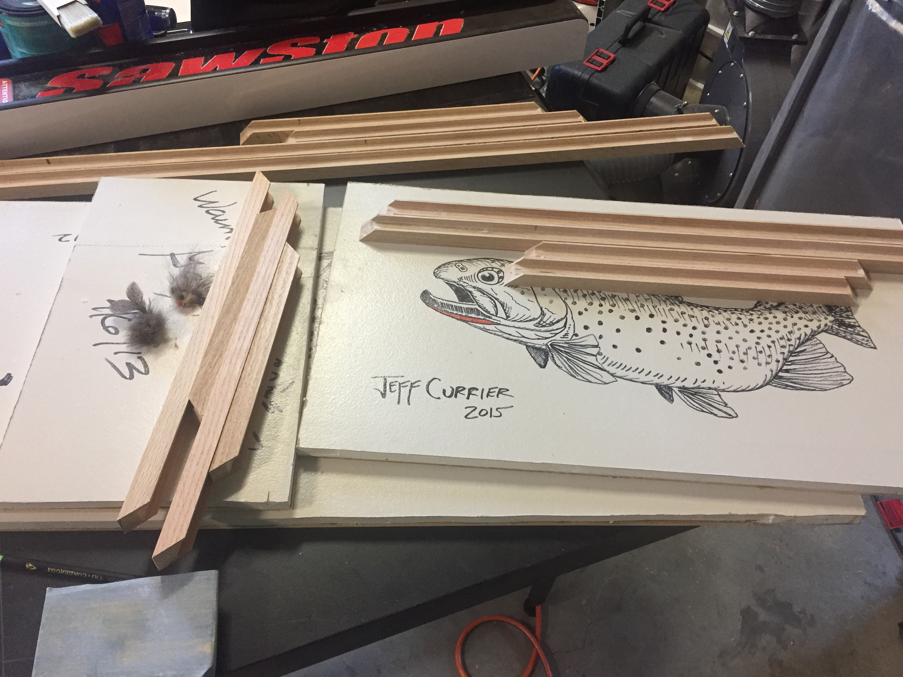
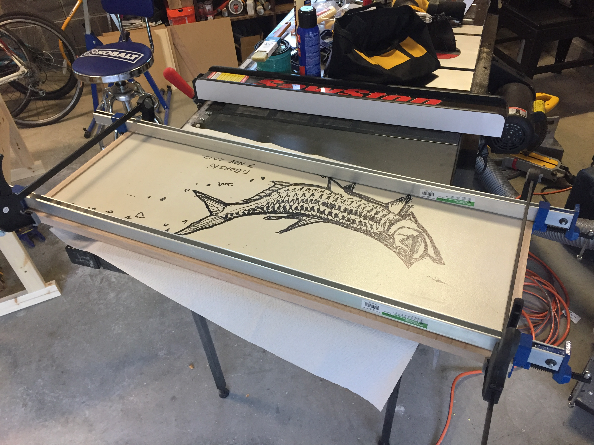
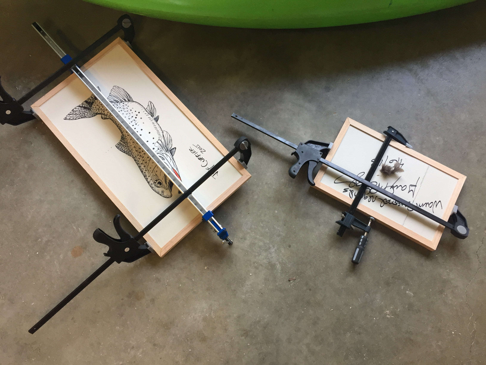
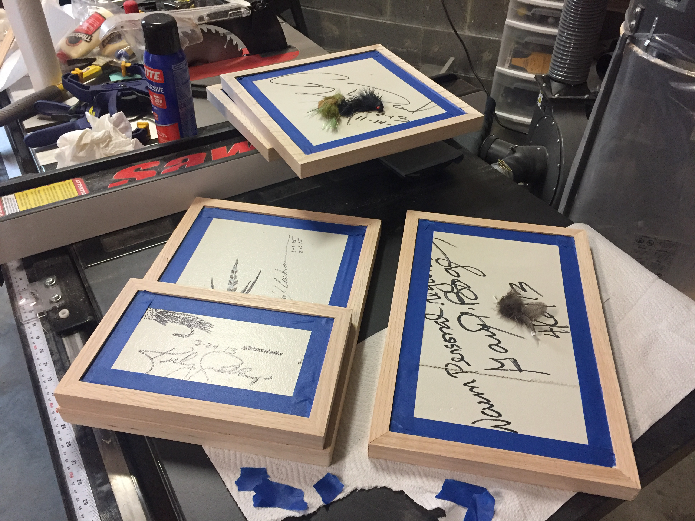
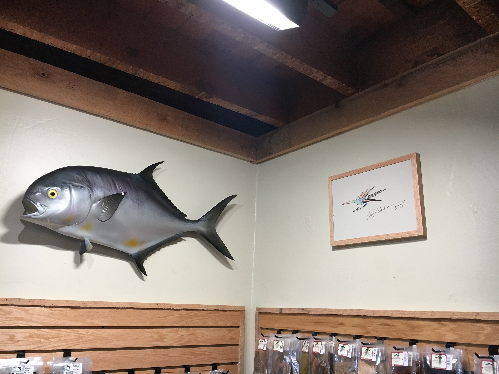
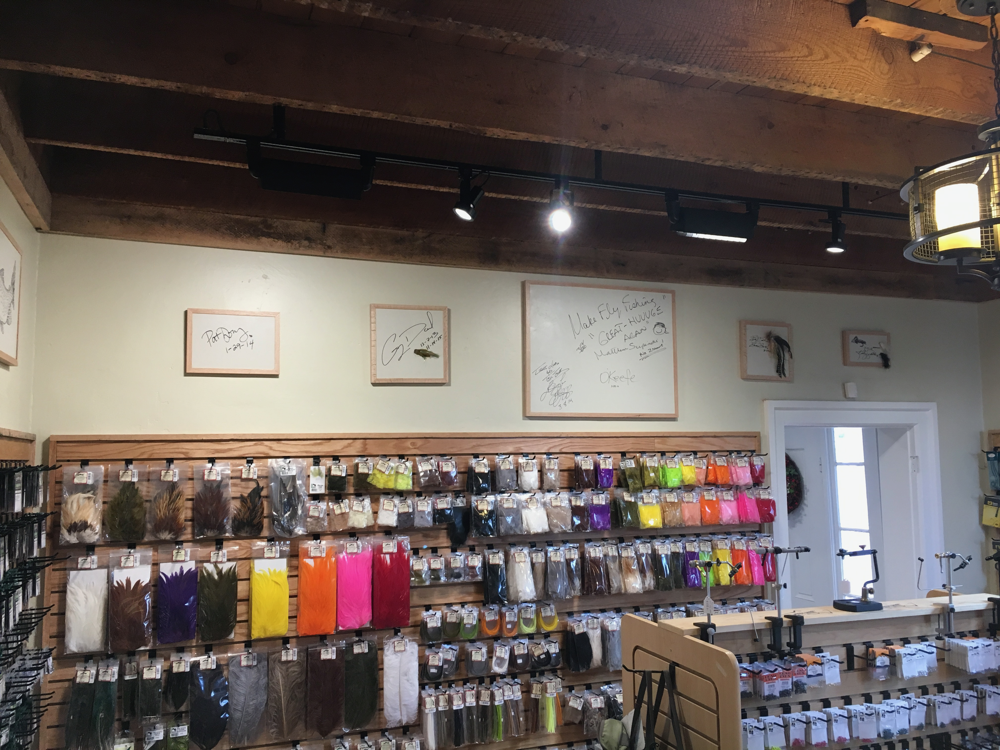
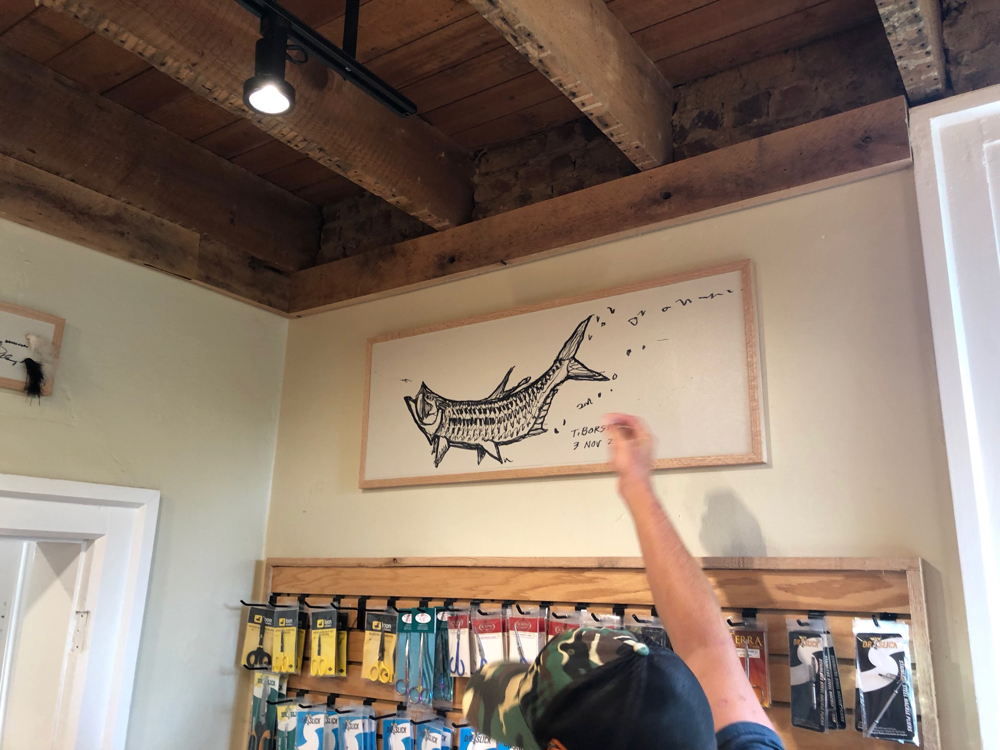

Every woodworker remembers their first real project. Mine came with a request from a my brothers who were moving their fly fishing shop to a new location and wanted to take some peices of the wall that had been signed by well known fishermen and artists. It was the perfect first project: simple joinery, a clear purpose, and a deadline that would keep me from overthinking things.

With the shop finally set up and the dust collector humming, it was time to put the tools to work. The first cuts on the table saw felt momentous, even if they were just simple rips to dimension some oak.

The artwork included pieces by Tim Borskiu and other fishing artists. Beautiful ink drawings of trout and tarpon, some with their signature flies attached. The frames needed to be simple enough not to compete with the art, but sturdy enough to protect these signed originals.

The larger pieces, like this tarpon drawing, required some creative clamping solutions.

It's hack to say, but always true... you can never have too many clamps.

The smaller frames featured fly fishing flies mounted alongside artist signatures.

Seeing the first frame hung on the new shop wall was a proud moment. The simple oak profile complemented the artwork without overwhelming it.

More frames went up, and suddenly there was a gallery wall taking shape among the bins of fly tying materials.

Great success!
