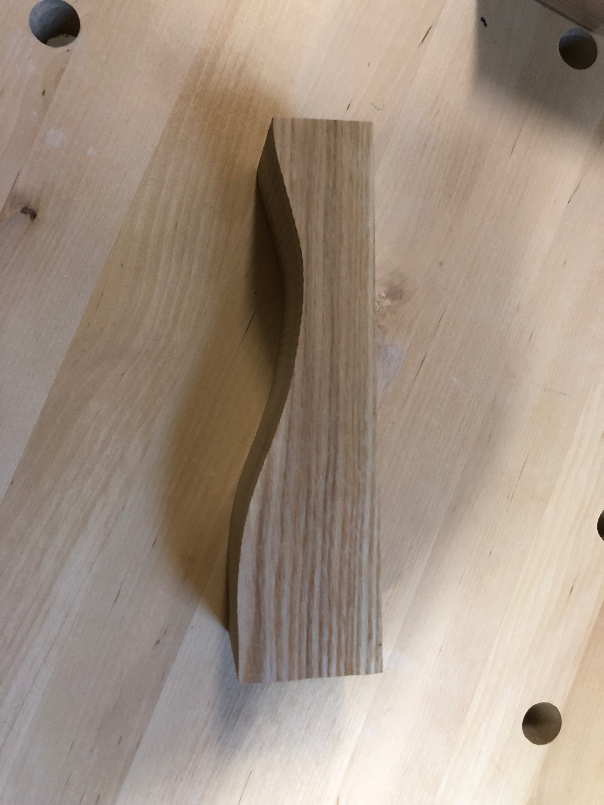
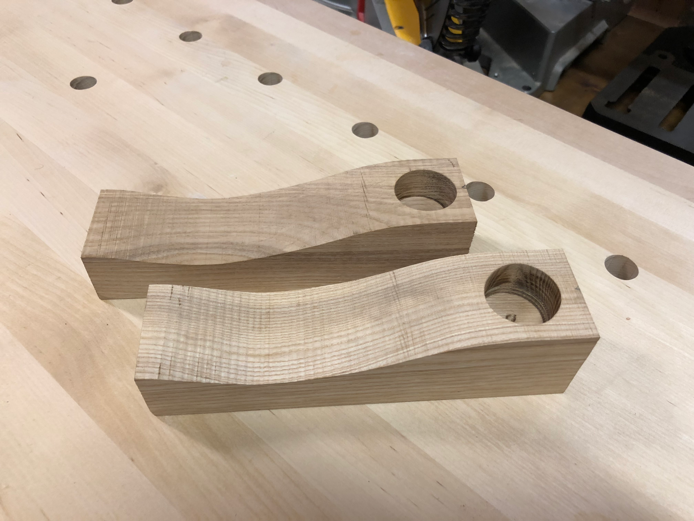
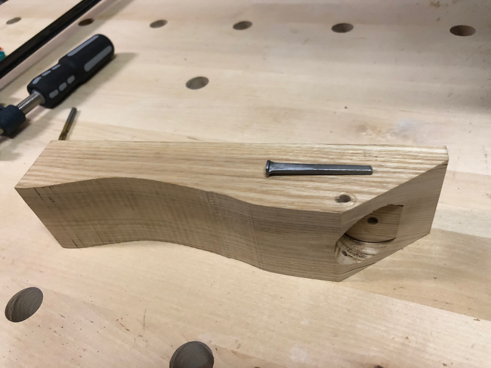
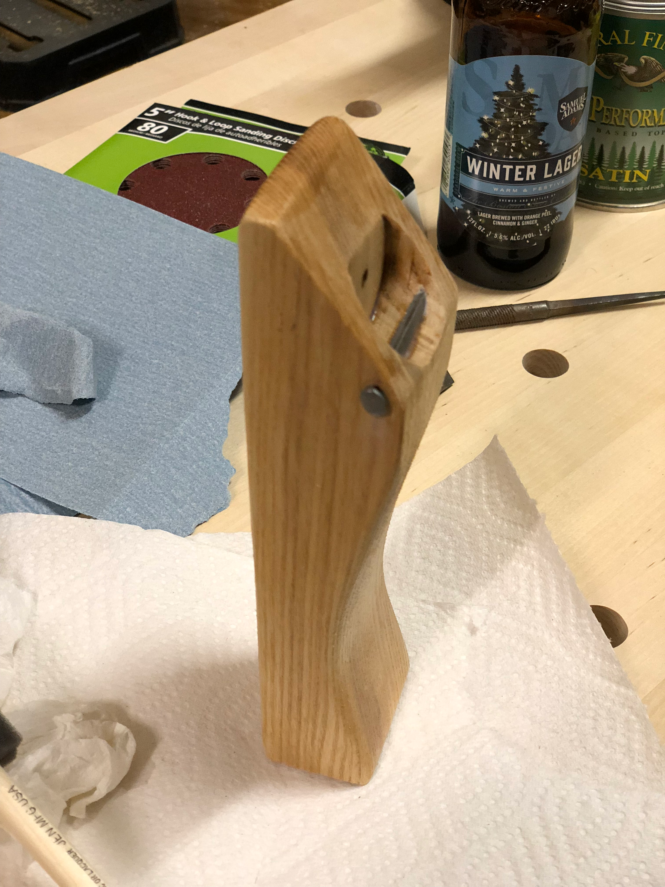
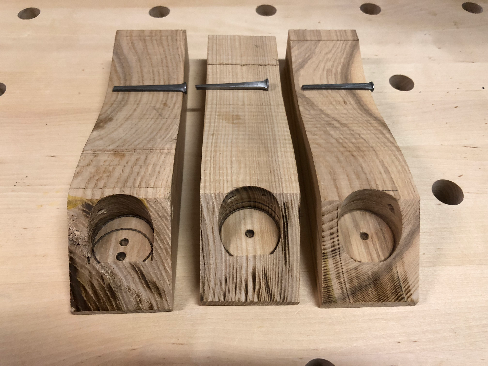
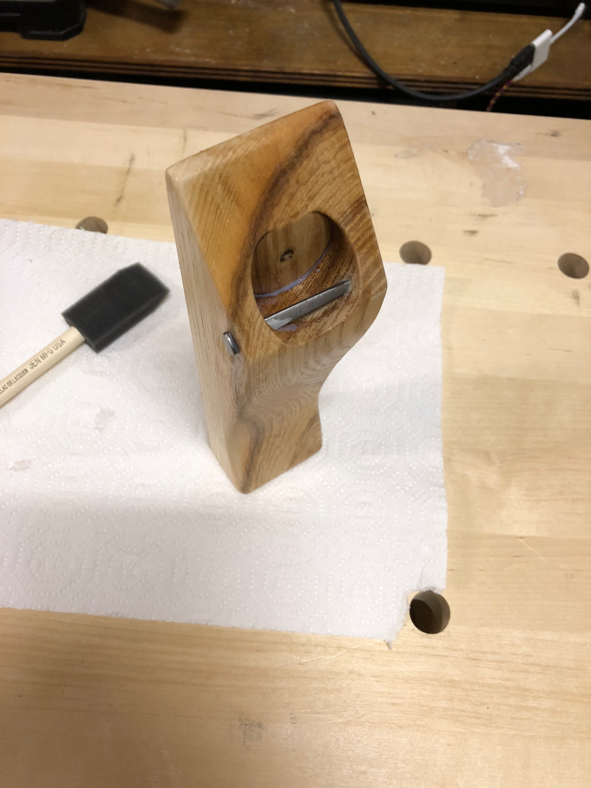

The holidays were approaching, and I needed gift ideas. What better way to spread woodworking cheer than handmade bottle openers? Simple enough to batch produce, useful enough that people would actually use them, and a great excuse to practice some bandsaw curves.

The design was straightforward and right out of Nick Offerman's book: an ergonomic S-curve that would feel natural in the hand. I figured out a template based on the dimensions and cut the profiles on the bandsaw. Oak seemed like the right choice for durability and that classic look.

The business end required a forstner bit to create a recess for the bottle cap, plus a smaller hole for an old fashioned nail for the opening lever.

With the hardware test-fitted, I could see the design coming together.

A few coats of satin finish brought out the grain and would protect against the inevitable beer splashes. Nothing fancy, these were meant to be used.

Once I had the process dialed in, I could knock out a small batch fairly quickly. Each one was slightly unique thanks to variations in the grain pattern.

The finished opener had a satisfying heft and a smooth feel in the hand. Pop tops became my go-to gift for the next few holiday seasons - practical, personal, and always appreciated by the craft beer enthusiasts in my life.
