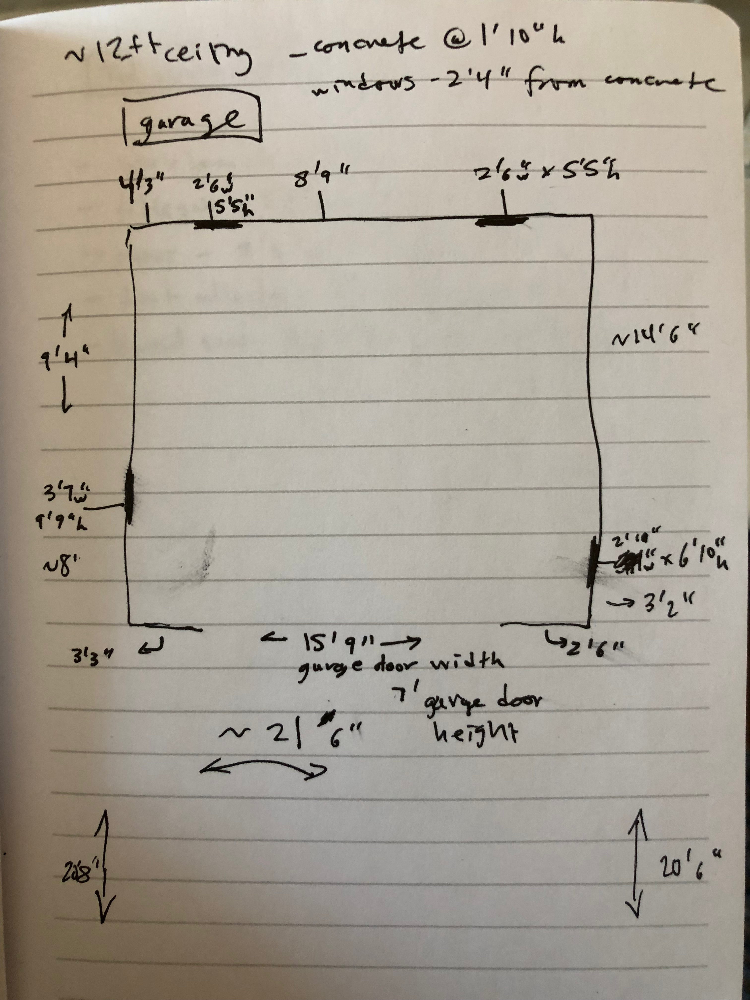
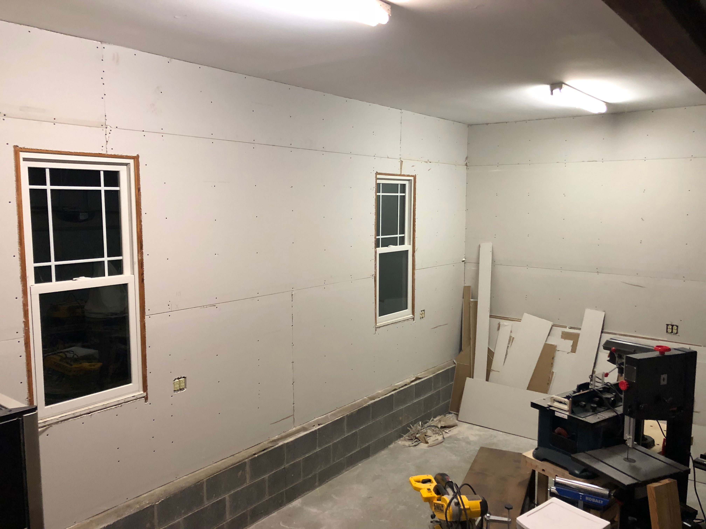
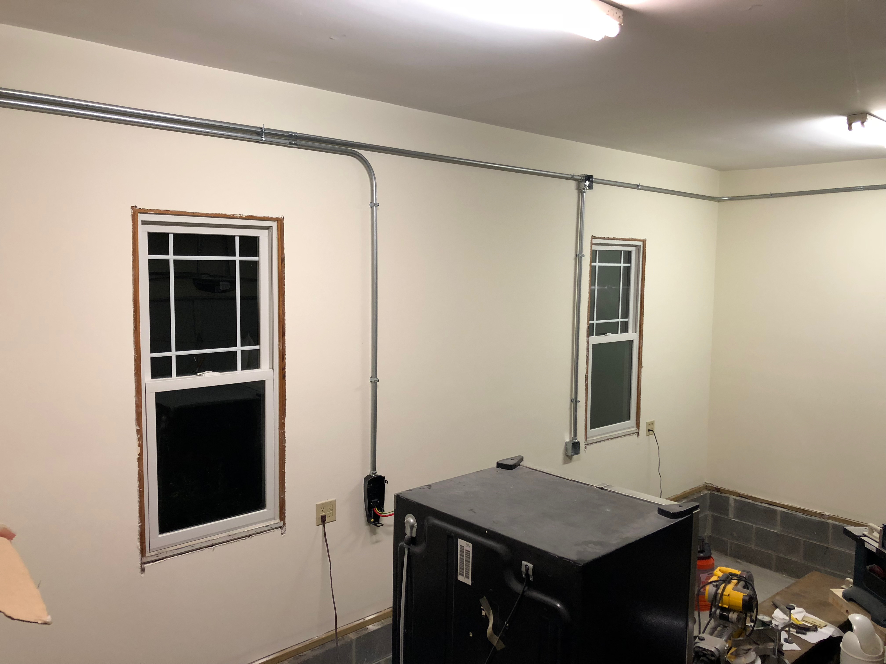
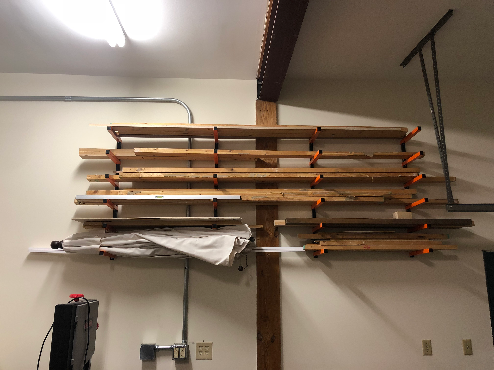
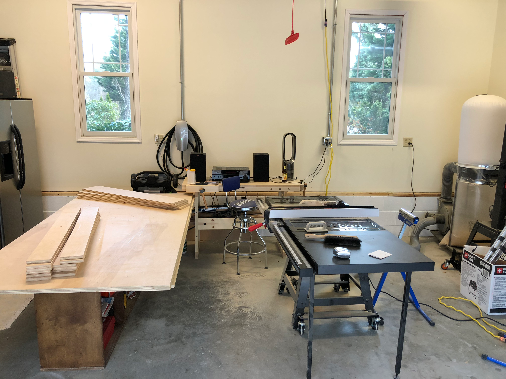
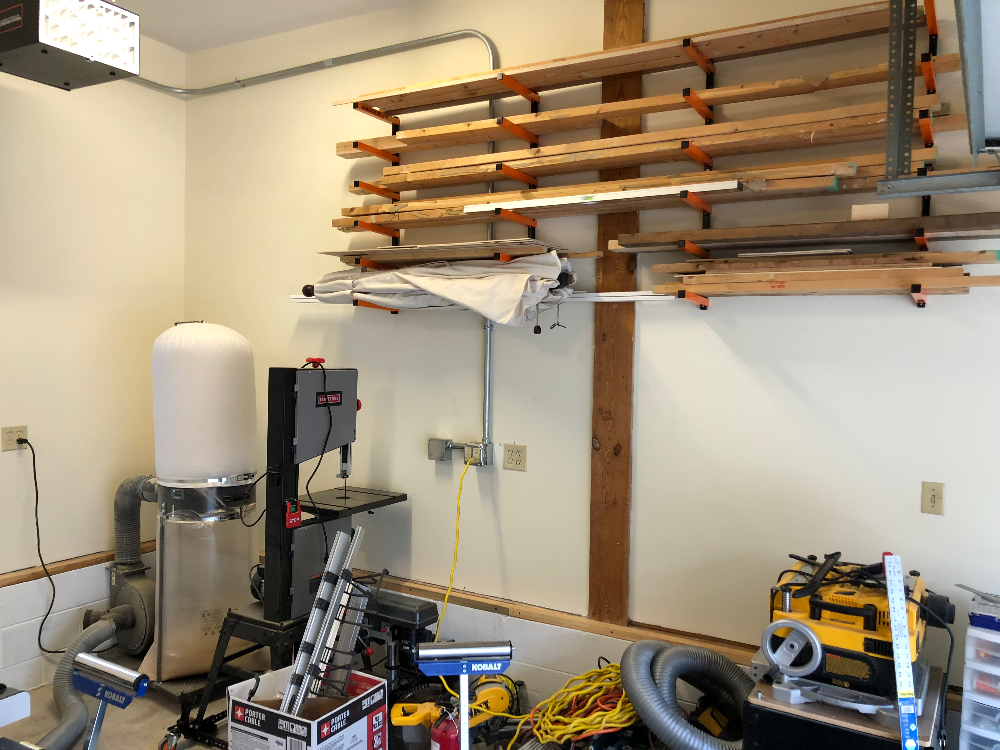

After a few projects, the limitations of the raw garage space became apparent. Exposed studs collected dust, the lighting was bad, and lumber was piling up in corners with no real organization. It was time for some shop infrastructure.

Every good project starts with a plan. I sketched out the garage dimensions, noting window locations and the garage door opening. The goal was to maximize usable wall space while improving the overall work environment (and leaving a space for my car).

Drywall went up first. It's not glamorous work, but finished walls make a huge difference in how a shop feels. The smooth surface would also be easier to keep clean and would help brighten the space by reflecting light.

With the walls ready, an electrician ran new circuits in surface-mounted conduit. More outlets meant no more extension cords snaking across the floor. A dedicated 240V circuit was left in case I needed to upgrade anything in the future.

The real game-changer was the lumber storage rack. Wall-mounted arms created a home for all those boards that had been leaning precariously in corners. Now I could actually see what stock I had available.

With painted walls and better lighting, the space started to feel like a real workshop.

Looking at the lumber rack loaded up with project materials, I finally felt like I had a proper shop. The upgrades weren't about making the space fancy - they were about making it functional. A well-organized shop means less time hunting for materials and more time actually building.

More upgrades to come, but this was a solid foundation.
