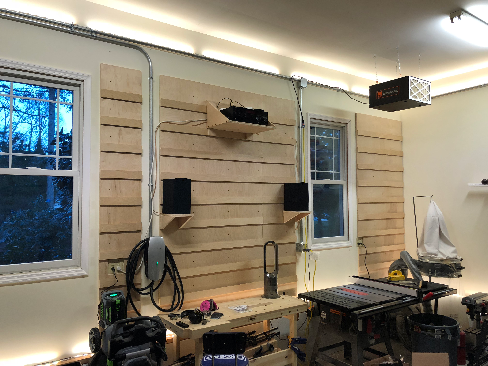
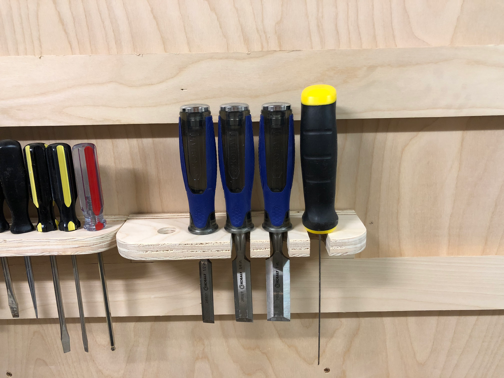
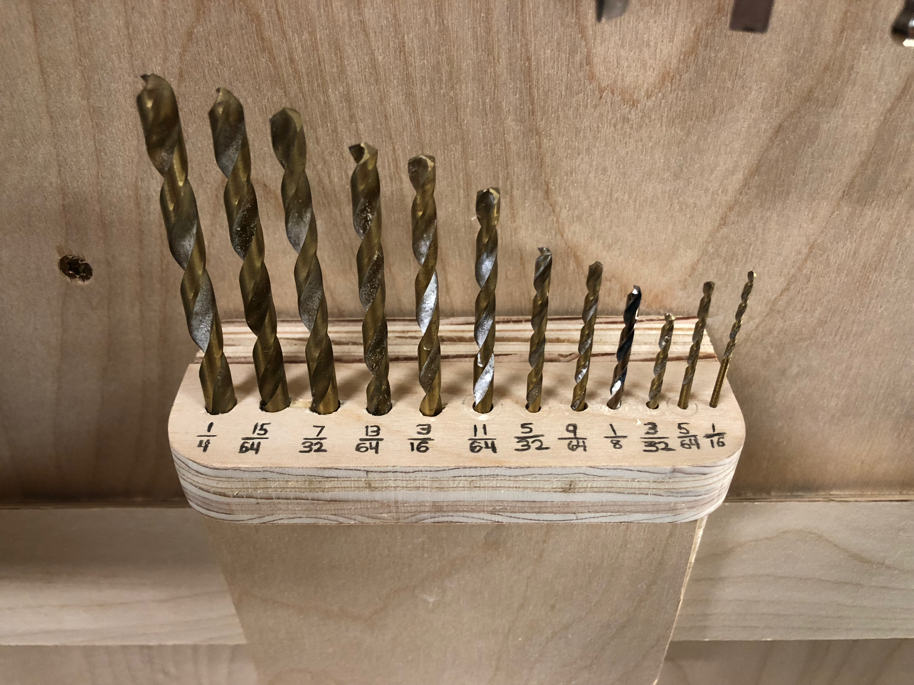
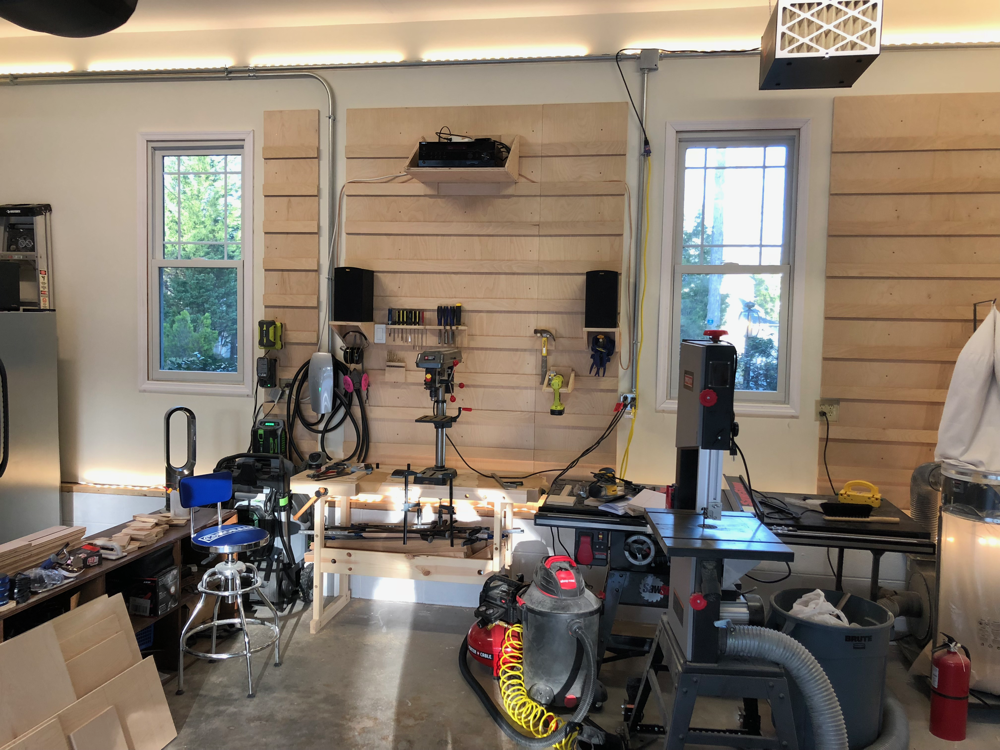
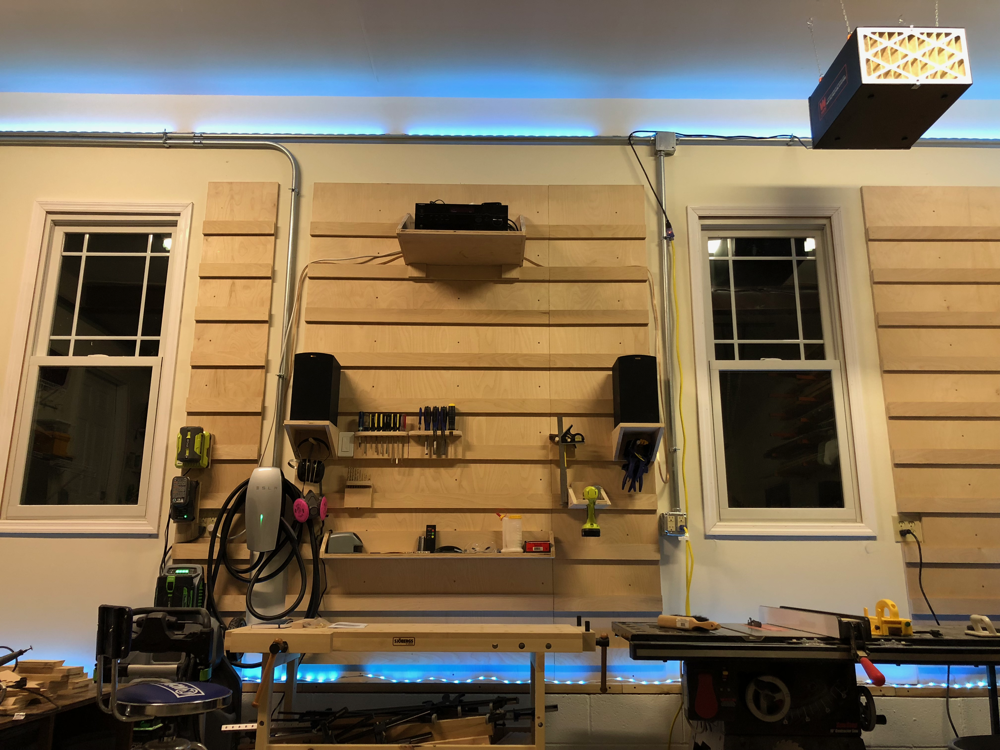

With the basic infrastructure in place, it was time for some finishing touches that would make the shop not just functional, but enjoyable to work in. A feature wall, better lighting, and some custom tool storage were on the agenda.

The centerpiece of this upgrade was a french cleat tool wall. Beyond looking great, the horizontal boards created natural ledges for mounting tool holders and shelves. Speakers flanked the wall for essential shop tunes, and a new shelf held the  receiver. LED strip lighting along the ceiling provided even, shadow-free illumination.

Custom tool holders made from scrap plywood took advantage of the new cleat wall. Chisels, screwdrivers, and other hand tools were now visible and within easy reach. No more digging through drawers.

A dedicated drill bit holder with sizes burned into the wood meant no more guessing or hunting for the right bit. Small touches like this add up to significant time savings over the course of a project.

Standing back, the shop had transformed from a raw garage into a proper workspace. The drill press, bandsaw, and other tools were arranged for efficient workflow, with the tool wall and bench at the core.

The LED lighting deserved its own moment. Strips along the ceiling provided ambient light, while under-cabinet strips illuminated work surfaces. The color-changing capability was admittedly more fun than functional, but why not enjoy where you spend your time?

A shop should inspire you to make things. These upgrades turned a utilitarian space into somewhere I actually wanted to be.
