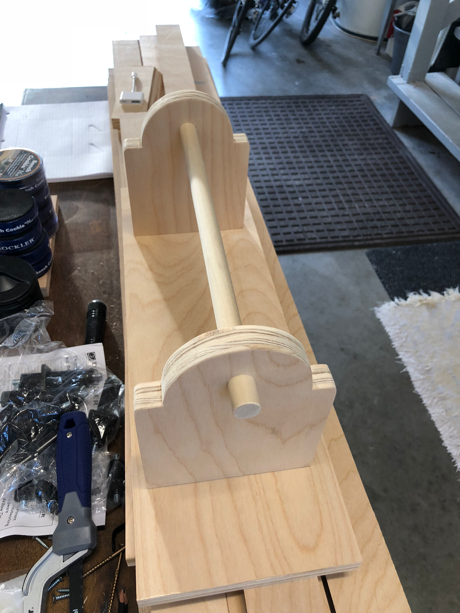
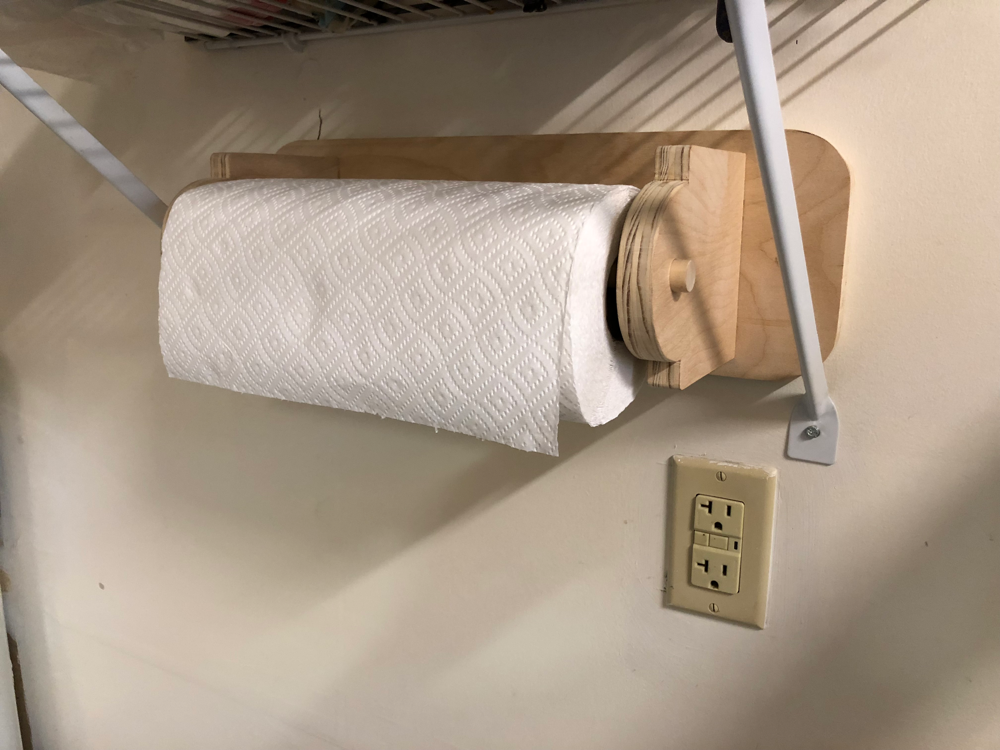
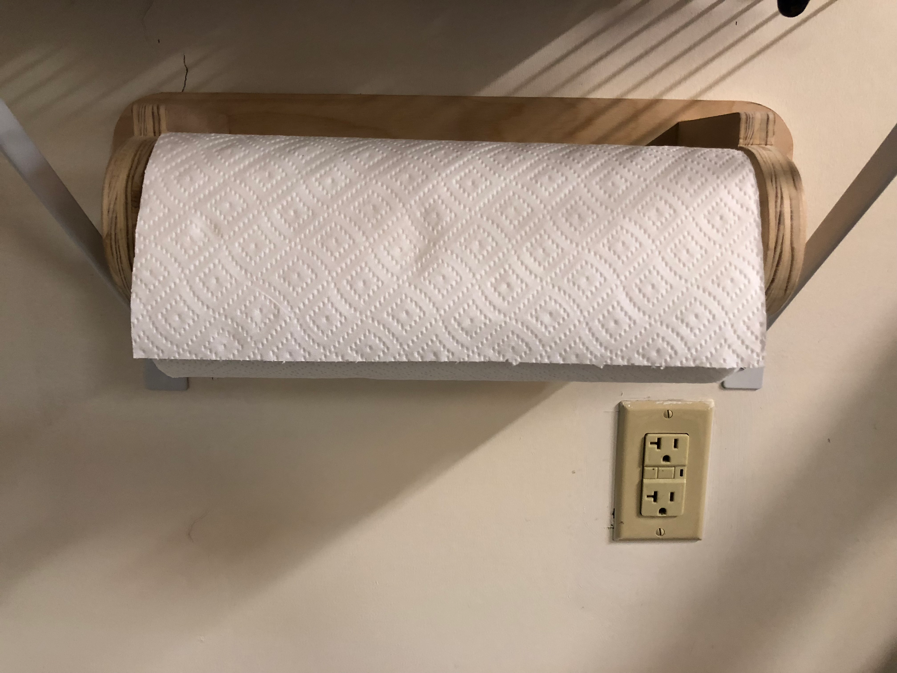

Sometimes the smallest projects bring the most satisfaction. Paper towels are essential in any shop - cleaning up finishes, wiping down tools, the occasional spill.

The design was simple: two circular plywood ends connected by a backboard, with a dowel rod to hold the roll. I cut the circles on the bandsaw and smoothed them on the disc sander.

The open design made swapping rolls easy - just slide the old cardboard tube off and the new roll on.

From the front, clean lines and functional design. Nothing fancy, but well-executed. It's been hanging in the same spot for years now, quietly doing its job.

Quick projects like this are great palette cleansers between bigger builds. A couple hours from idea to finished product, and something useful at the end. Not everything needs to be a masterpiece - sometimes you just need a paper towel holder.
