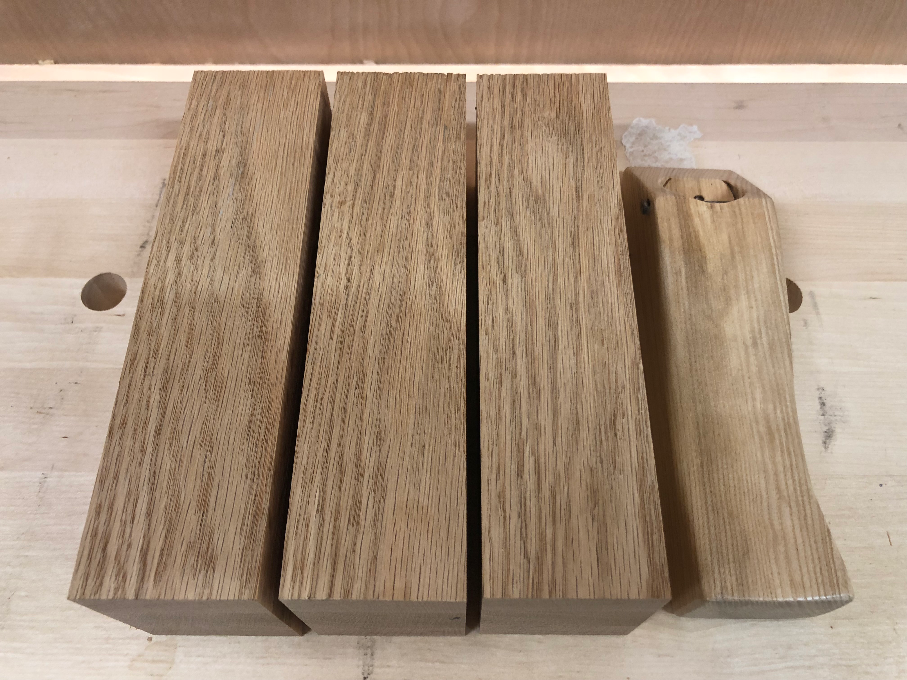
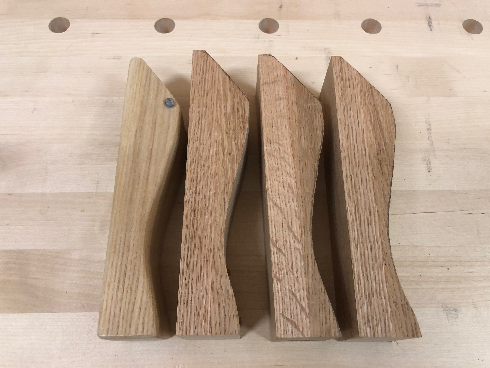
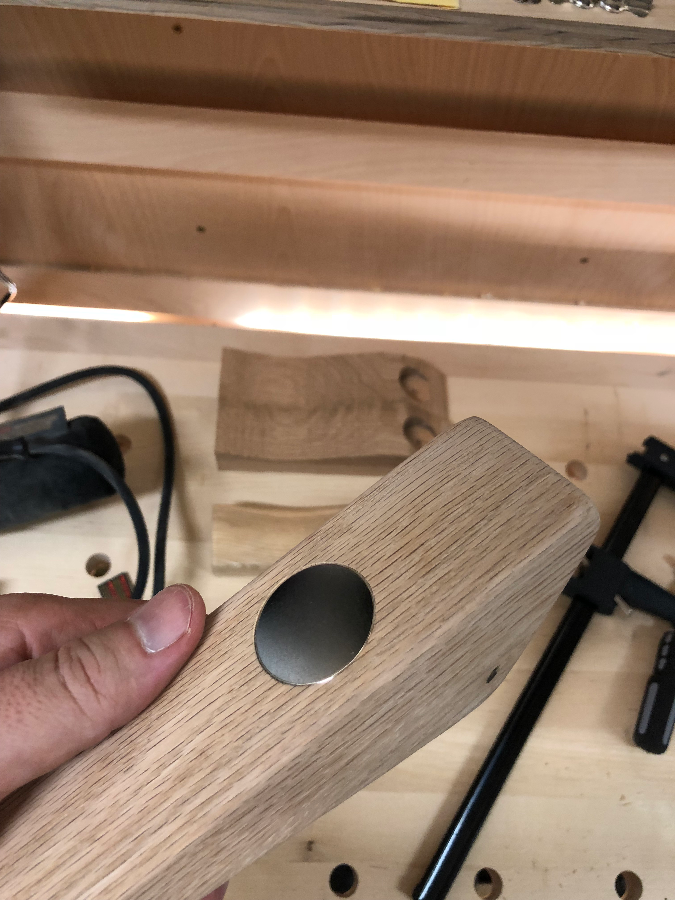
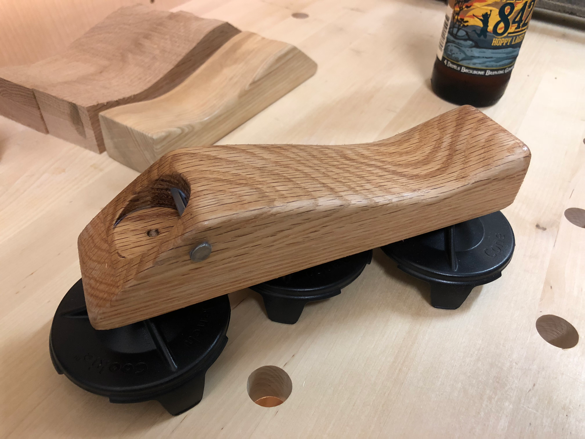
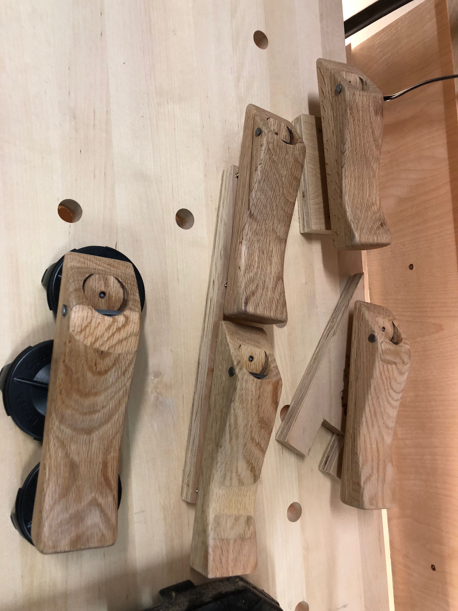

The original pop tops were a hit, but after making a bunch of them I started seeing ways to improve the design. Time for Mark 2.

Starting with fresh oak blanks, I refined the proportions. The original design worked, but felt a bit chunky. These would be sleeker, with a more comfortable grip.

I experimented with several different curve profiles, cutting each on the bandsaw and then shaping with rasps and sandpaper. The goal was finding that sweet spot between ergonomic comfort and visual appeal.

The big upgrade for Mark 2: an embedded rare-earth magnet. No more bottle caps flying across the room or landing in your drink. Pop the cap, and it sticks right to the opener. A forstner bit created a perfectly sized recess for the magnet.

The finished Mark 2 sitting on its magnetic feet - those are the same magnets used for cap catching, doubling as a display stand. The oak grain really pops after a few coats of finish.

A family of openers emerged from the design process. Each one slightly different as I dialed in the curves. The variations in grain pattern meant no two were exactly alike - a feature, not a bug.

Iteration is everything in design. The Mark 2 openers were better in every way than the originals, and the lessons learned would carry forward to future projects. Sometimes you have to make something twice to make it right.
