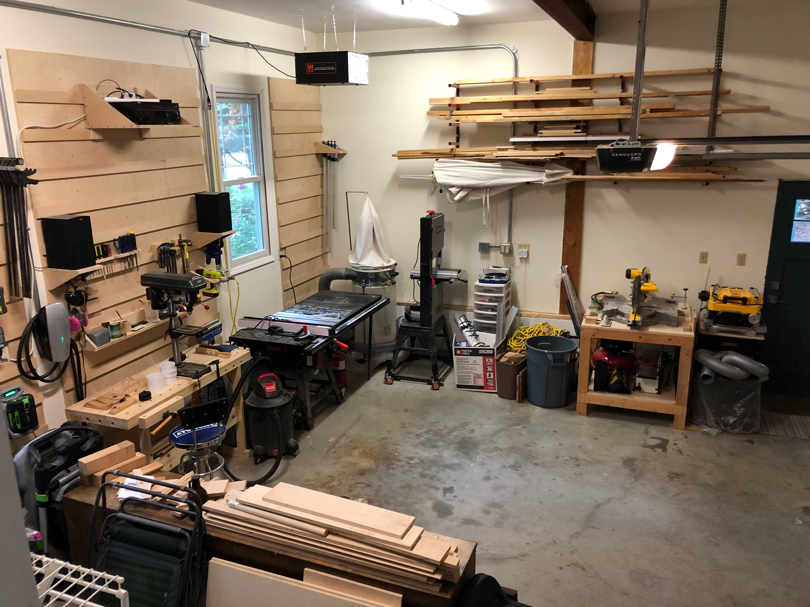
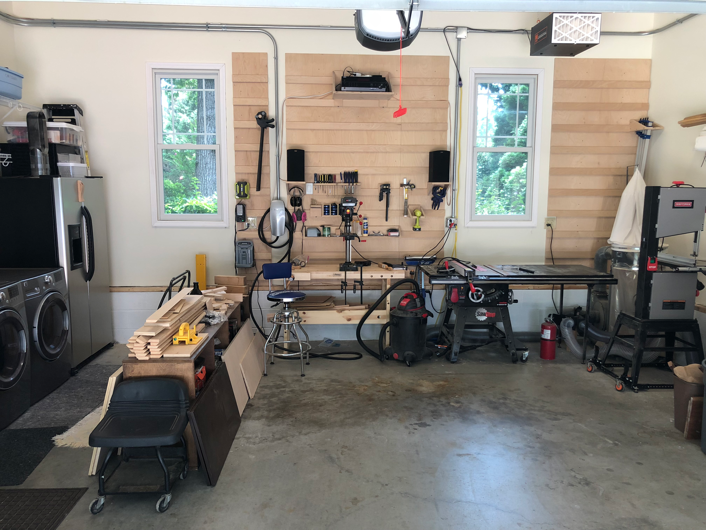

After completing several projects, I had a better sense of how I actually used the shop. Time for another round of reorganization based on real-world workflow rather than theoretical layouts.

Looking down from the doorway, the shop had evolved considerably from its early days. The lumber rack stayed loaded with project stock, the miter saw station handled crosscuts, and the main work area flowed around the table saw and workbench.

The French cleat had become the nerve center: hand tools within reach, drill press for precision holes, and the shop vac standing ready. Even the laundry machines to the left got incorporated into the workflow, providing a convenient flat surface for staging parts.

The key insight from this reorganization was accepting that a shop is never really "done." As your skills grow and your projects change, the space needs to adapt. What works for building picture frames isn't optimal for building furniture. The best shop layout is the one you're willing to keep tweaking.
