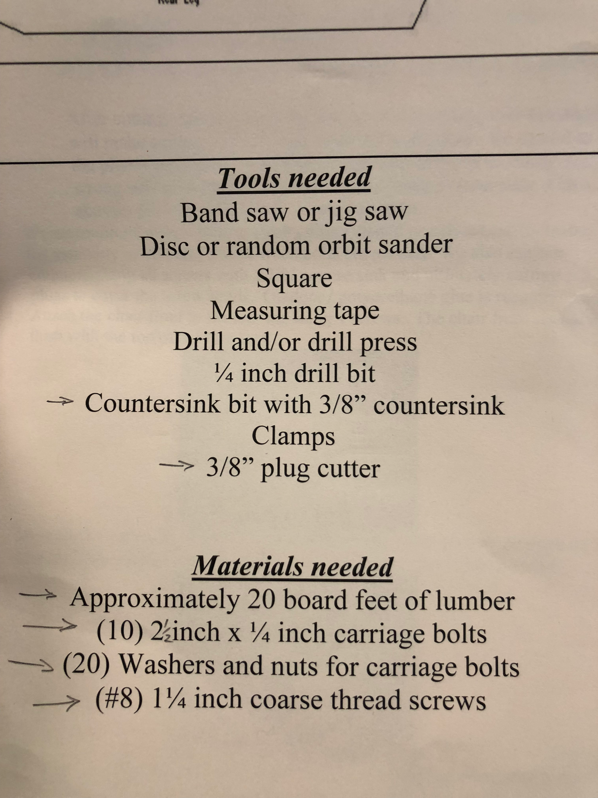
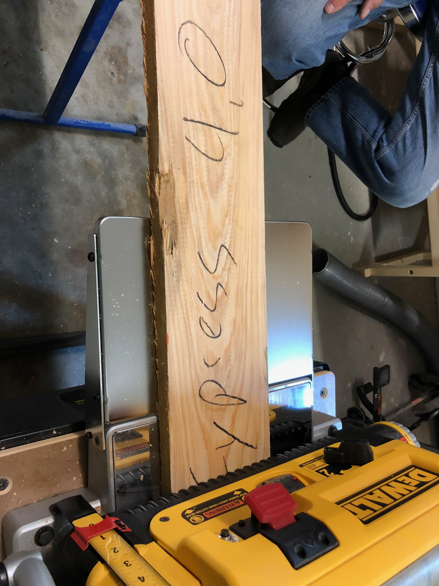
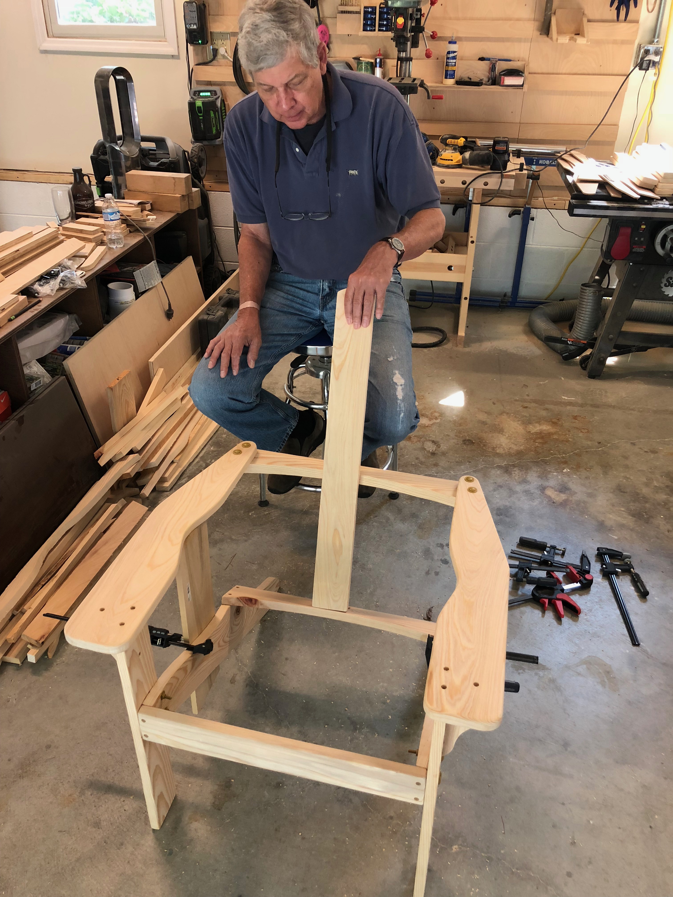
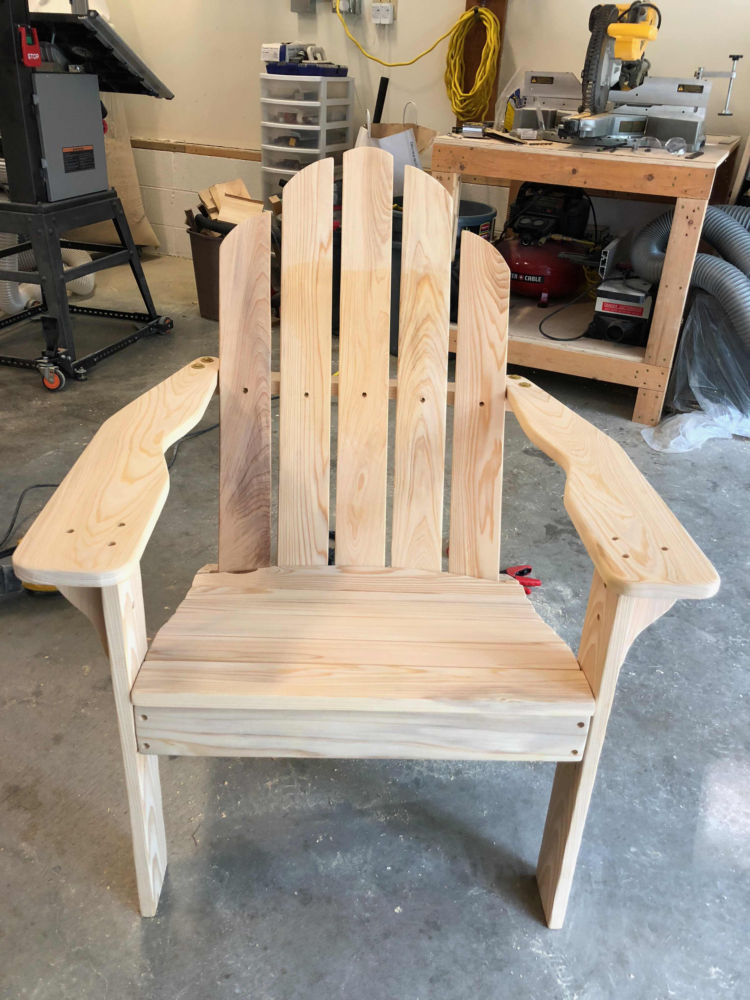
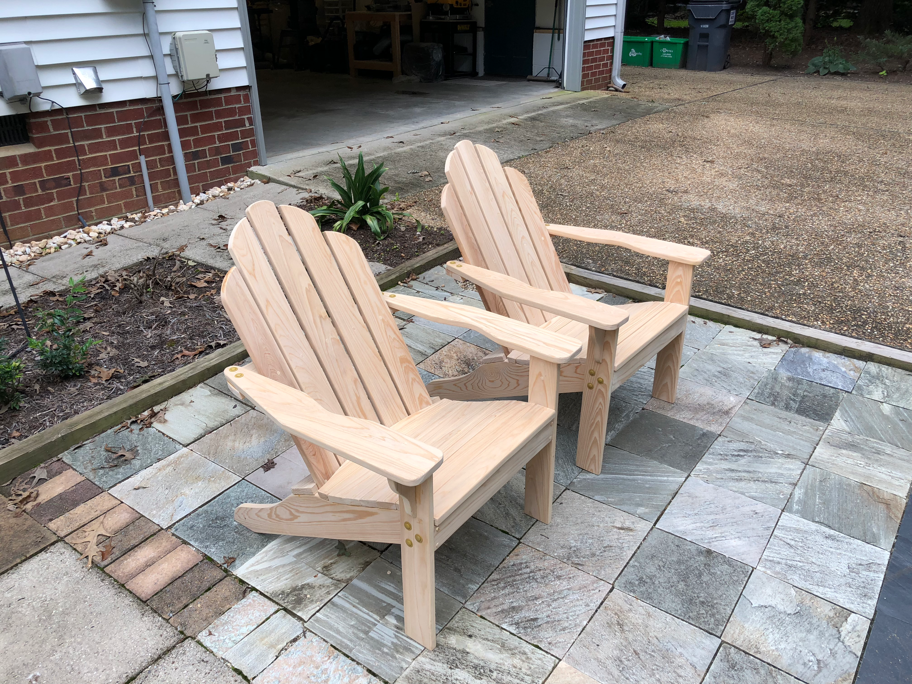

There's something deeply satisfying about building furniture you can actually sit in. Adirondack chairs had been on my project list since day one - iconic design, comfortable for lounging, and a great test of skills across multiple techniques.

I found a solid set of plans that called for about 20 board feet of lumber per chair, carriage bolts for the structural connections, and plugs to cover the screw holes. The tool list was manageable: bandsaw for curves, drill press for precision holes, and lots of sanding.

Cypress was the wood of choice for these outdoor chairs. Naturally rot-resistant and stable in changing weather, it's the traditional material for porch furniture in the South. I marked up the boards for efficient cuts.

Dad came over to help with the build - there's nothing like an extra set of hands when you're trying to hold curved pieces at odd angles. The chair frame came together quickly once we had a rhythm going.

The first chair complete and ready for a test sit. The curved back slats and wide armrests are what make an Adirondack an Adirondack. Plenty of room for a drink on that armrest.

Chairs come in pairs, of course. Seeing them sitting on the patio, ready for actual use, was incredibly rewarding. These weren't just shop projects anymore - they were furniture that would get used for years to come.

Round one complete, but definitely not the last Adirondacks I'd build.
