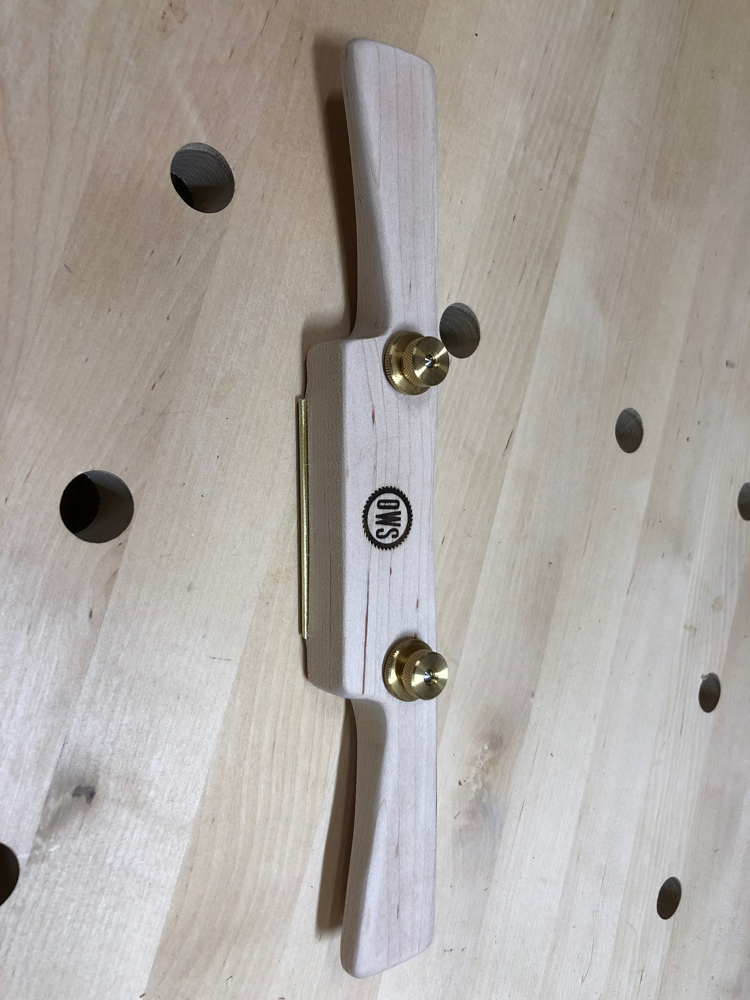
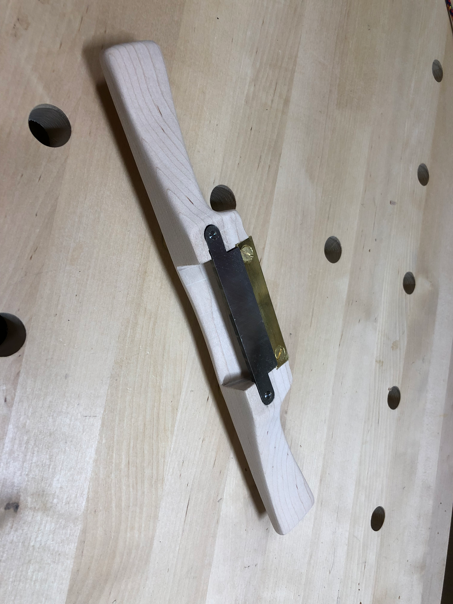

Hand tools have a special place in woodworking. There's something about the direct connection between your hands and the wood that power tools can't replicate. When I spotted a spokeshave kit, I couldn't resist.

The kit came with all the brass hardware - adjustment screws, blade cap, and wear plates - but the wooden body was up to me. I chose a piece of hard maple for durability and shaped the handles to fit my grip.

The underside reveals the business end: a razor-sharp blade that shaves thin curls of wood with each pass. Spokeshaves excel at shaping curves and rounding edges - perfect for chair legs, tool handles, or any piece that needs to feel good in the hand.

Building your own tools is a woodworking tradition that goes back centuries. There's a certain pride in using a tool you made yourself, and the spokeshave has earned a permanent spot on my tool wall.
