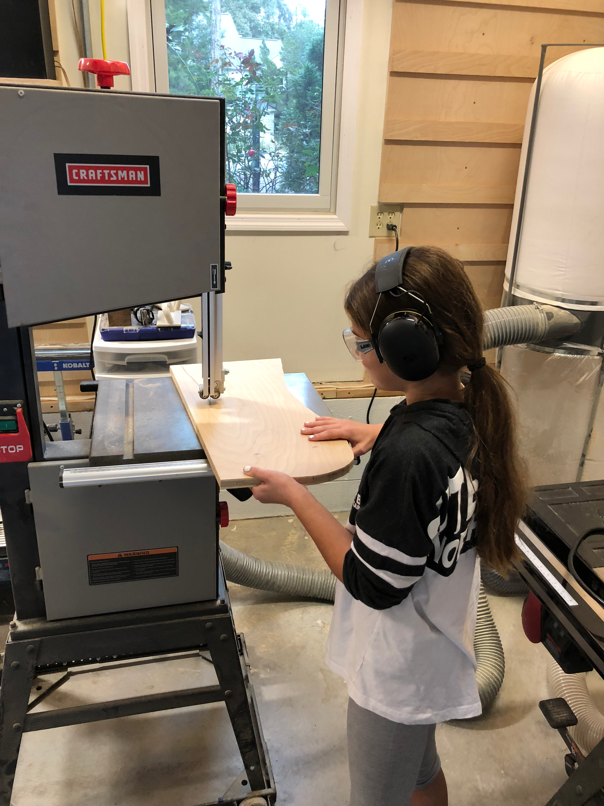
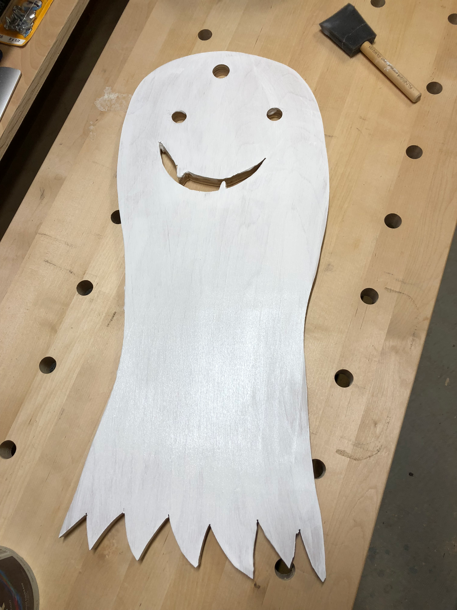

Halloween called for a quick project, and I had a helper eager to try out the bandsaw. With proper safety gear - hearing protection and safety glasses - she guided the plywood through the curves of our ghost template.

The bandsaw is a great first power tool for young woodworkers. The blade moves in one direction (down into the table), the workpiece stays flat, and the feed rate is completely controlled by the operator. Perfect for building confidence and learning to read how the wood responds.

A few coats of white paint, some drilled eye holes, and a cutout smile transformed the plywood blank into a proper spooky ghost. Not bad for an afternoon project.

Sometimes the best projects aren't about fancy joinery or exotic woods. They're about making something fun with someone you care about, and maybe sparking a lifelong interest in making things.
