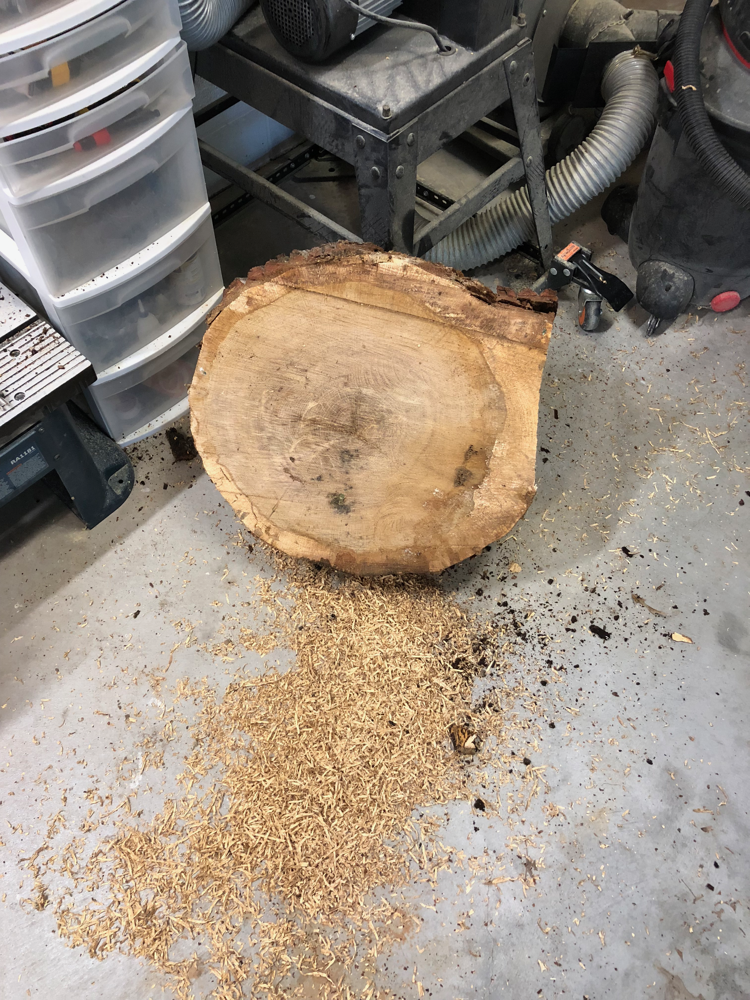
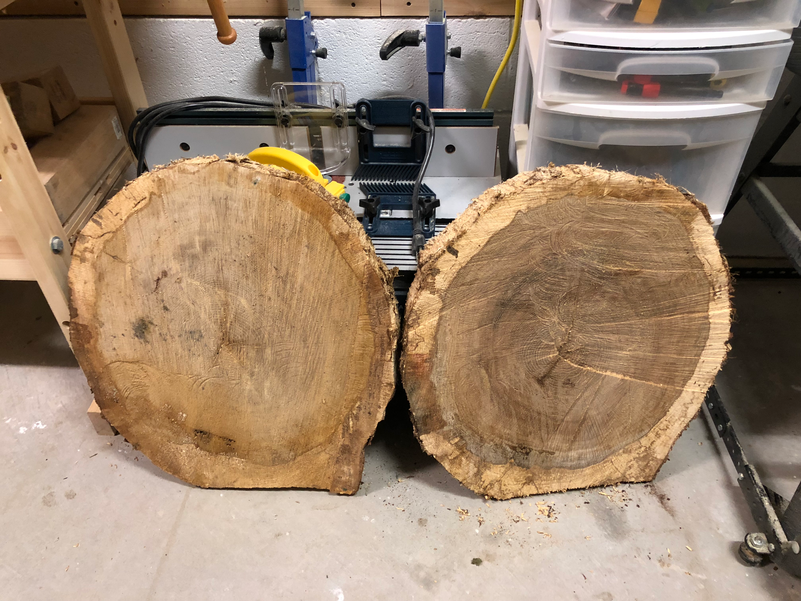
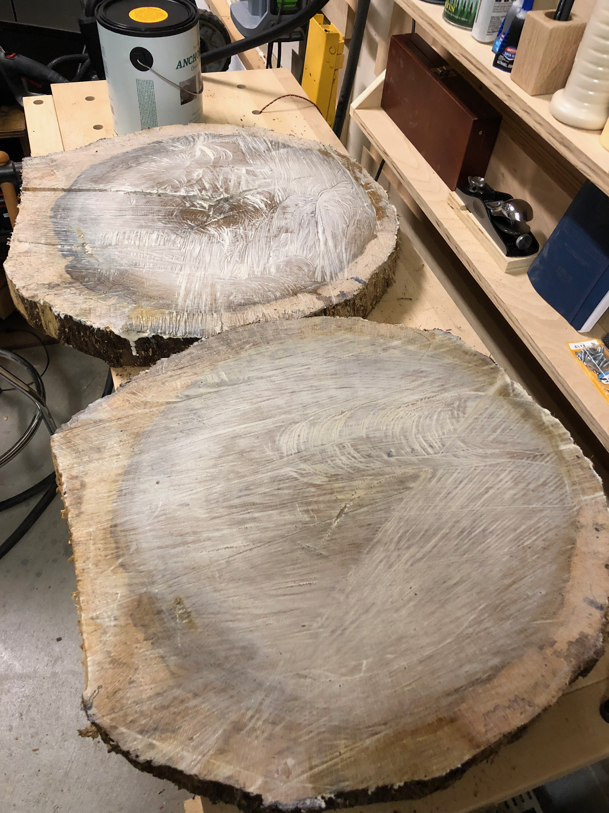

When a neighbor's oak tree came down, I saw an opportunity. Cross-sections of a tree - "wood cookies" - make beautiful display pieces, showing off the growth rings and natural character that you'd never see in dimensional lumber.

The stump told the story of a mature tree, decades of growth visible in those concentric rings. I arranged for a few thick slices to be cut with a chainsaw before the rest was hauled away.

Back in the shop, the raw slices were impressive but rough. Chainsaw marks, uneven thickness, and bark still attached. These would need some serious work to become usable.

Two cookies of similar size would make a matched pair. The grain patterns were unique to each slice, captured at slightly different heights along the trunk.

Flattening cookies this size required a router sled - a flat reference surface that the router rides across, removing material until the cookie is uniformly flat. Multiple passes with progressively finer bits, then sanding to bring out the grain.

These cookies would eventually become side tables, but that's a project for another day. For now, they needed time to stabilize and dry properly. Rushing would only lead to cracks.
