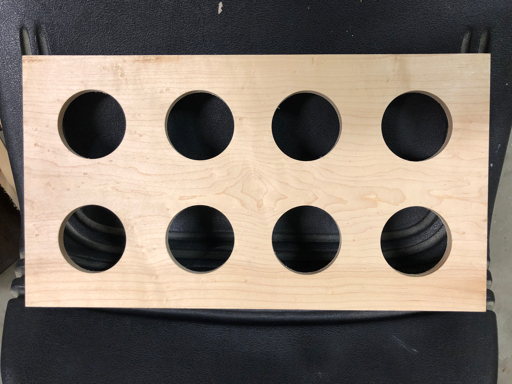
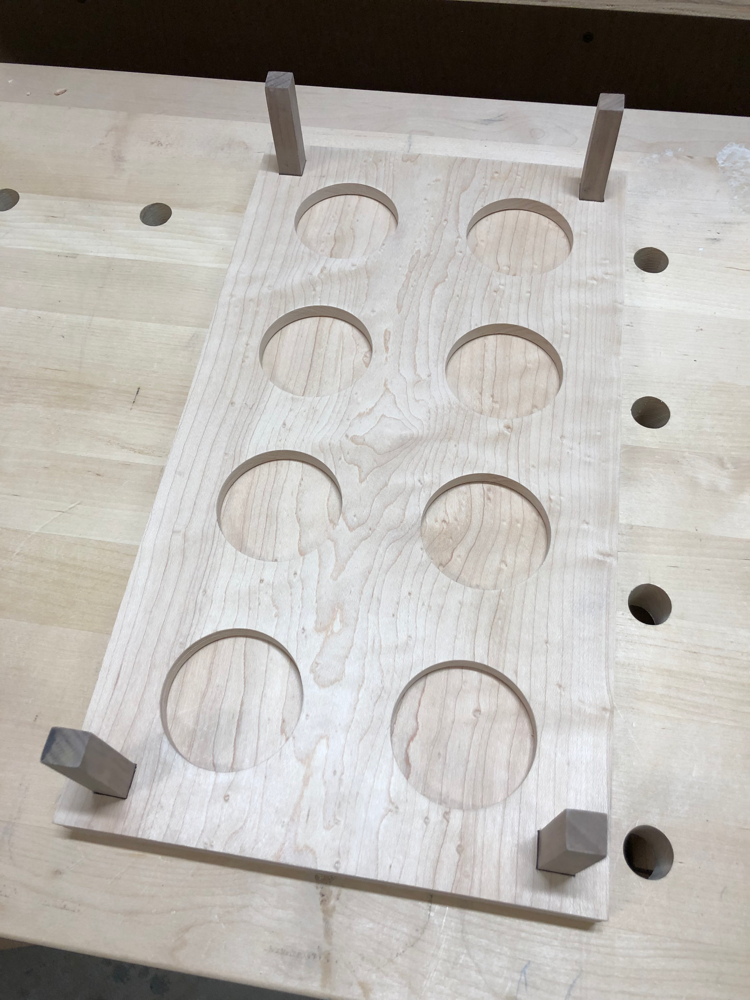
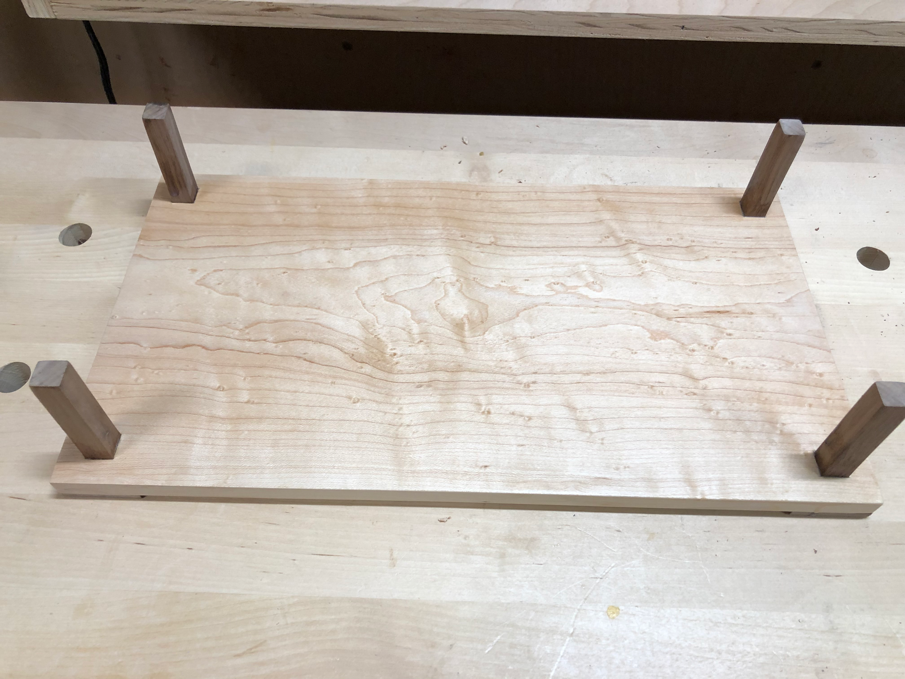
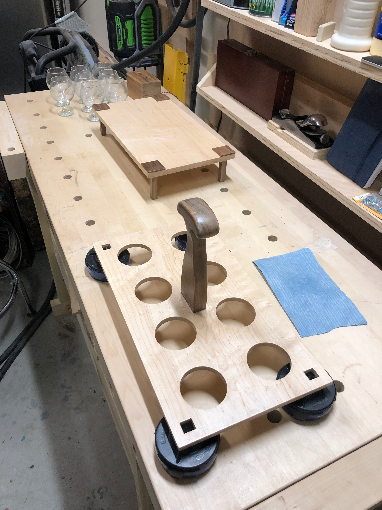
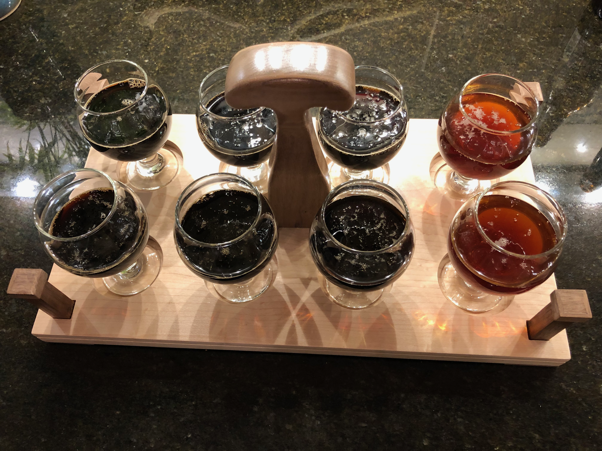

Craft beer deserves a proper presentation. When hosting tastings at home, I wanted something better than a cardboard carrier. A wooden flight cart would hold eight tasting glasses and look good doing it.

The design started with a piece of curly maple - those shimmering waves in the grain would really pop under finish. Eight holes sized exactly to fit my tasting glasses, cut with a forstner bit on the drill press.

The top piece rides the rails of the base like an elevator.  Pick it up, and the glasses suspend in the air, held by holes in the top piece like a snifter glass.  Put it down, and the top and bottom collapse together, so you can easily pick the glass out of the lineup.

Walnut feet elevated the board slightly, providing clearance for carrying and a nice visual contrast against the light maple. The curly figure in the maple really started to show as the finish went on.

The handle was shaped from walnut to match the feet. A comfortable grip was essential - this thing would be carried while full of beer. The spokeshave got a good workout shaping those curves.

The finished flight cart in action, loaded up with a variety from dark stouts. The curly maple catches the light beautifully, and the walnut accents tie it all together.

Projects like this are why I got into woodworking - something functional, something beautiful, and something that makes everyday moments a little more special.
