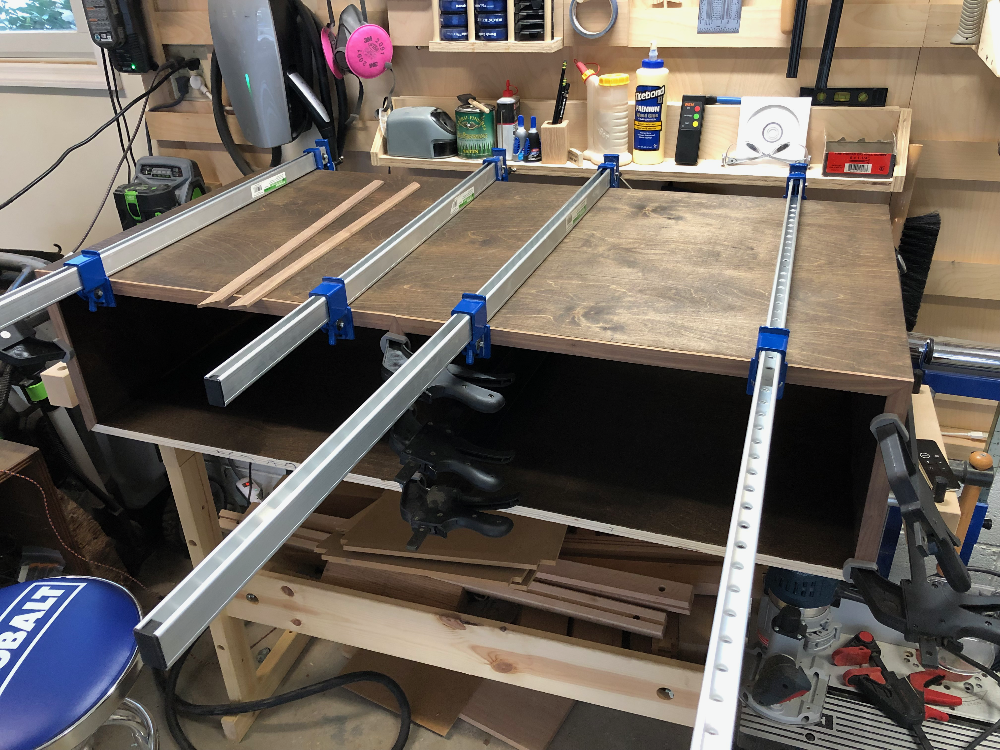
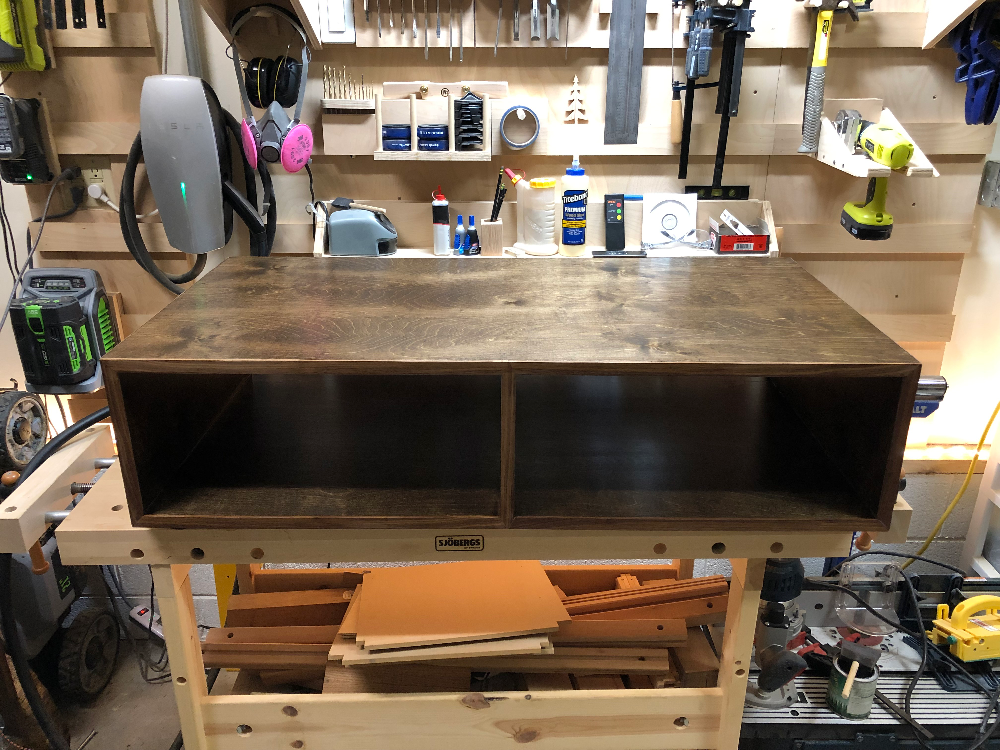
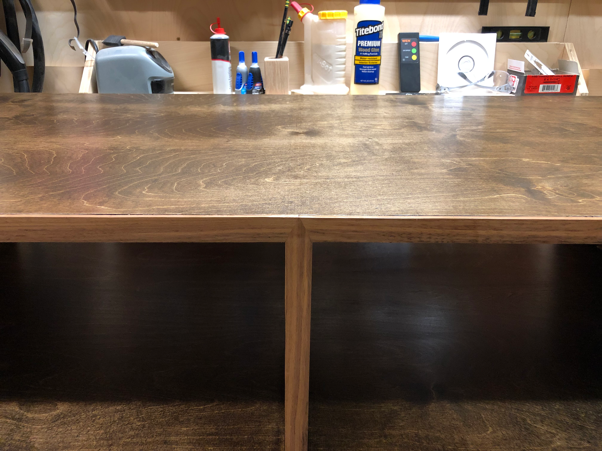
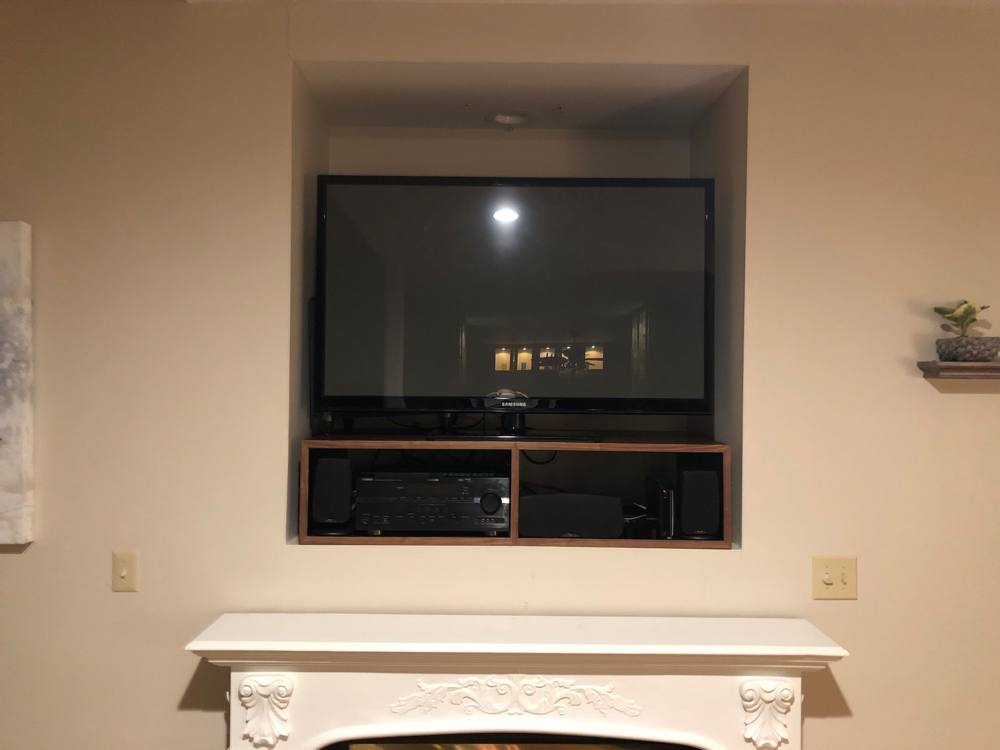
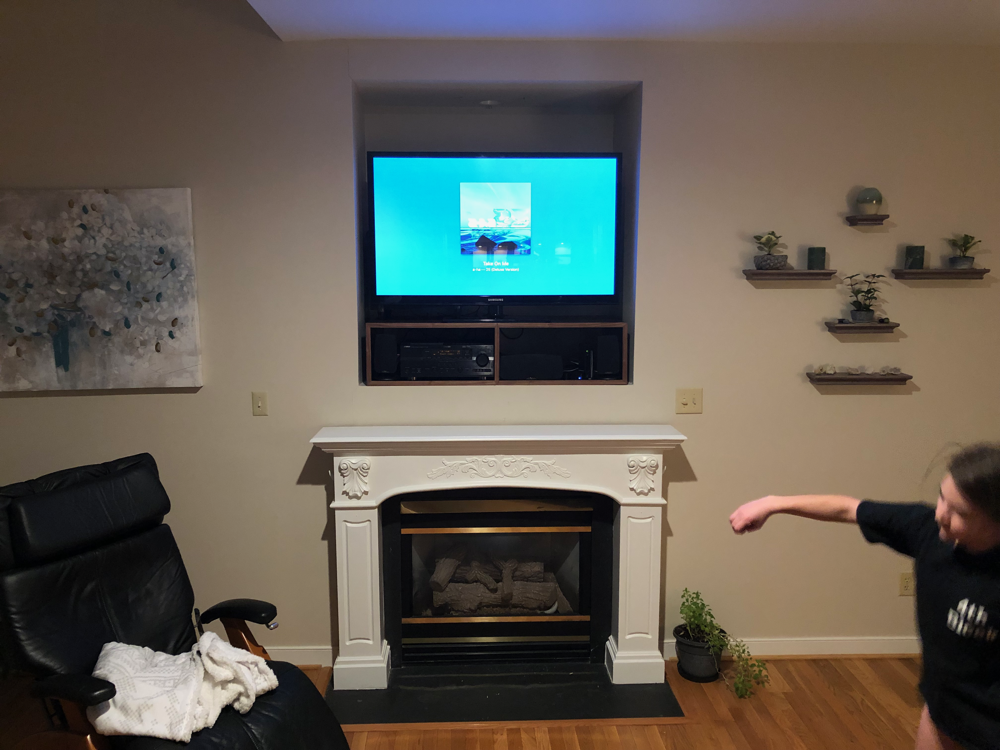

The TV nook above our fireplace had a problem: plenty of room for a big screen, but nowhere elegant to put the stereo receiver and other components.

The cabinet needed to fit precisely into the nook dimensions while providing two cubbies for equipment. Walnut stained plywood gave me the rich color I wanted with the stability needed for a piece that would live in a warm spot above the fireplace.

The finished cabinet in the shop, ready for installation. Clean lines, no visible hardware, just two open compartments sized for a receiver and cable box. The center divider added structural rigidity and visual balance.

The figure really showed after finish was applied. The walnut color would match other pieces I had in mind for that room.

Installed in the nook, the cabinet fit like it was always meant to be there. The dark walnut complemented the TV and receded visually, letting the screen be the focus while keeping the electronics organized and accessible.

From the couch, the whole setup came together. Custom floating shelves on the side (another quick project) held small plants and decor. The stereo receiver finally had a proper home.

Built-in furniture is some of the most satisfying work because it transforms a space. This wasn't just a cabinet - it was the solution to an everyday annoyance, made exactly to fit.
