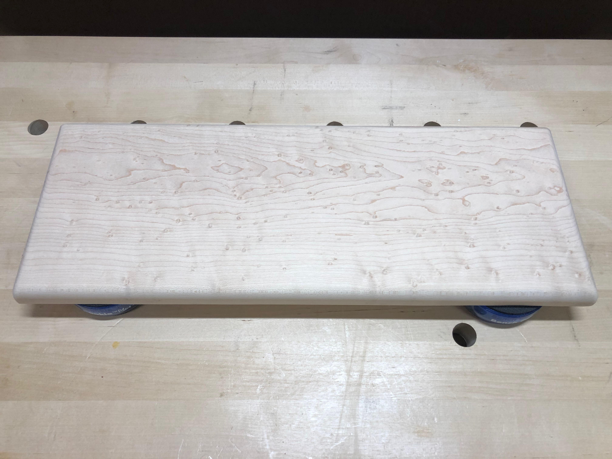
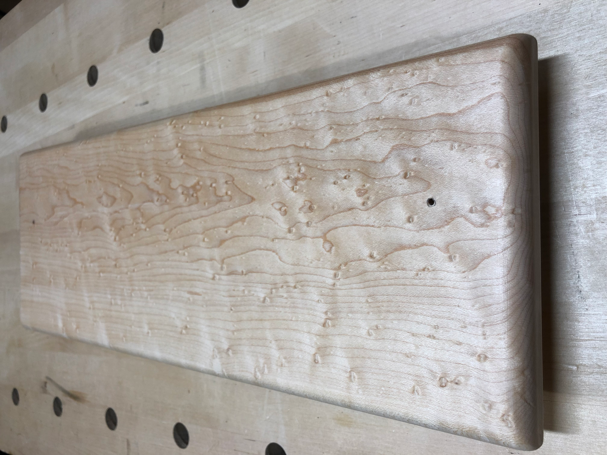
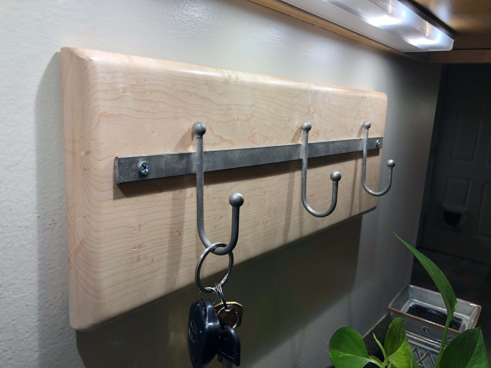

Some projects start with a piece of wood that's too beautiful not to use. I'd been holding onto a board of birdseye maple, waiting for the right project. A key holder for the entryway turned out to be the answer.

The birdseye figure in this maple was exceptional - those distinctive "eyes" scattered across the grain like stars. I shaped the board with rounded edges and embedded magnets along the back for mounting.

Up close, the birdseye pattern is mesmerizing. These figure patterns are caused by unusual growth conditions and are relatively rare, making pieces like this worth showcasing rather than hiding in a drawer.

Mounted by the front door with a simple metal hook rail, the key buddy serves its purpose beautifully. Keys have a home, and every time you grab them you get to appreciate that stunning wood grain.

Sometimes the simplest projects are the most satisfying - take a beautiful piece of wood, shape it thoughtfully, and let it do what it does best: look amazing while being useful.
