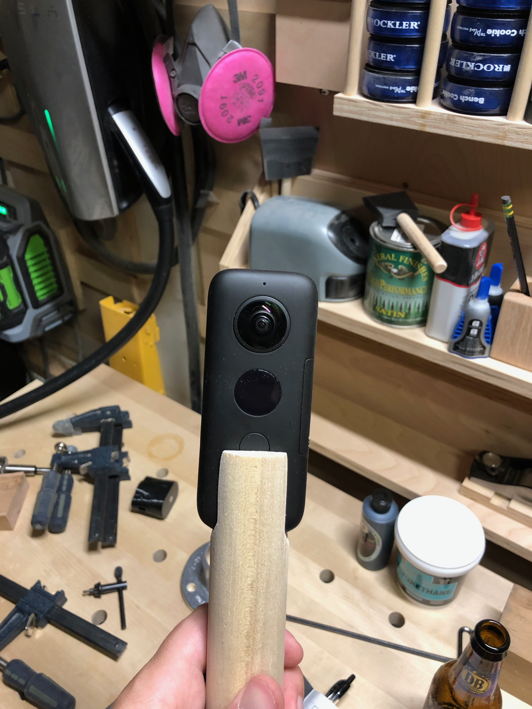

When hobbies collide, interesting projects emerge. My 360 camera needed a better grip than the tiny plastic nub it came with. Why buy a generic selfie stick when you can make something with character?

A piece of maple got turned into a comfortable grip, shaped to fit naturally in the hand. The camera threads onto a standard mount embedded in the top. The wood provides warmth that plastic never could, and it's sized perfectly for one-handed operation.

Quick projects like this are one of the joys of having a shop set up and ready to go. See a problem, grab some scrap, solve it in an afternoon. The 360 camera now has a handle worthy of the footage it captures.
