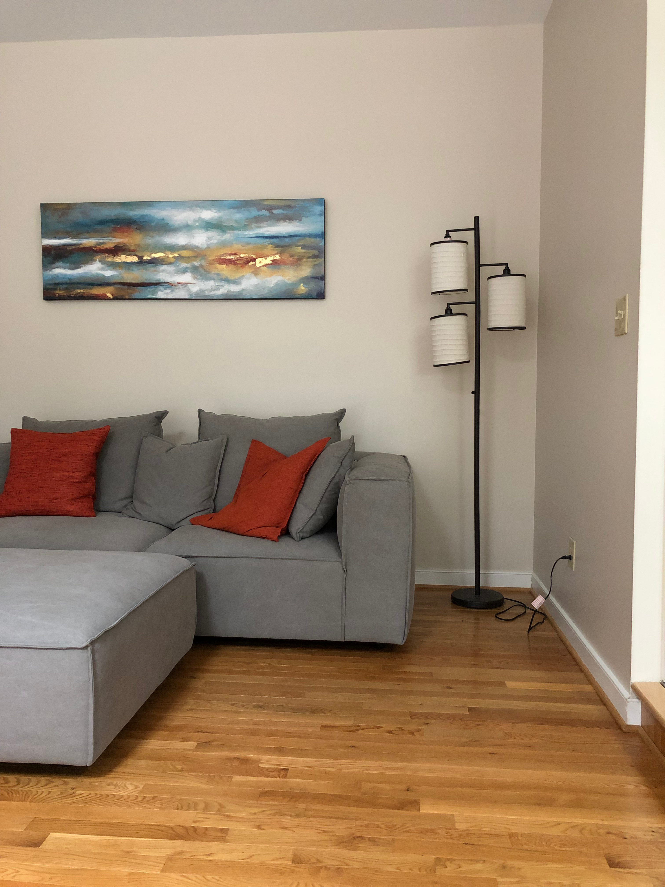
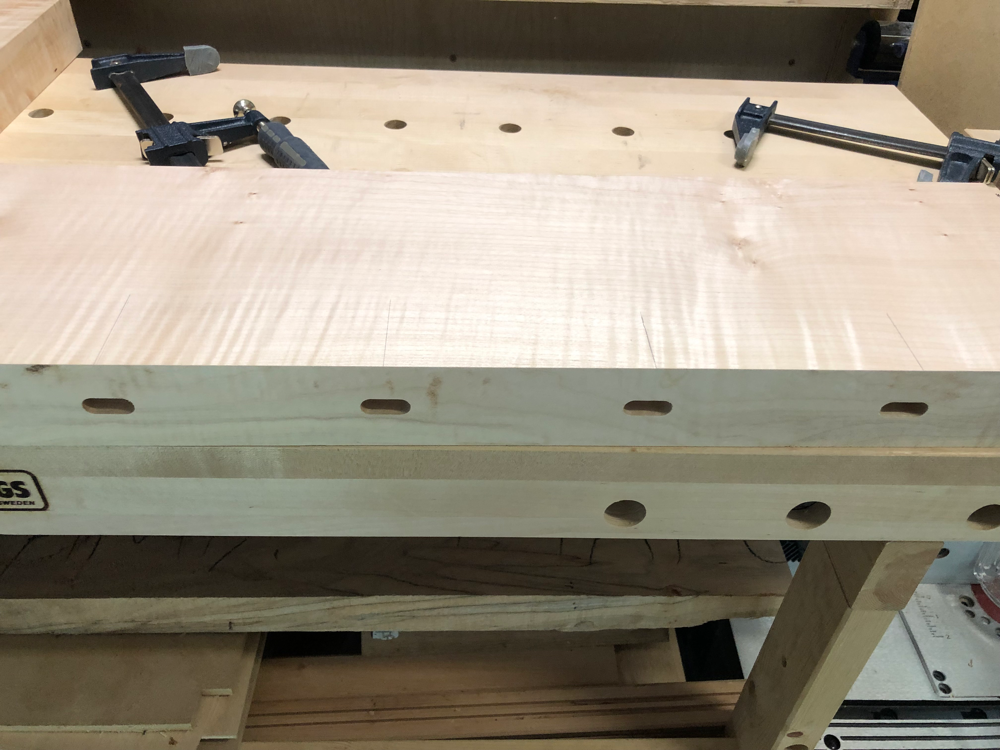
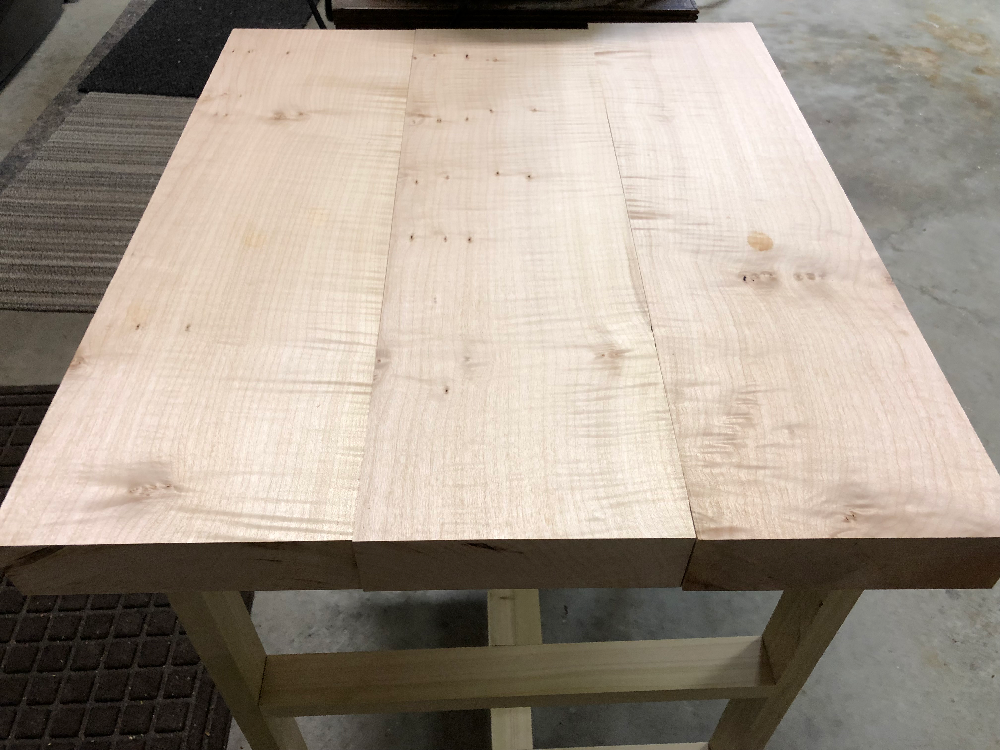
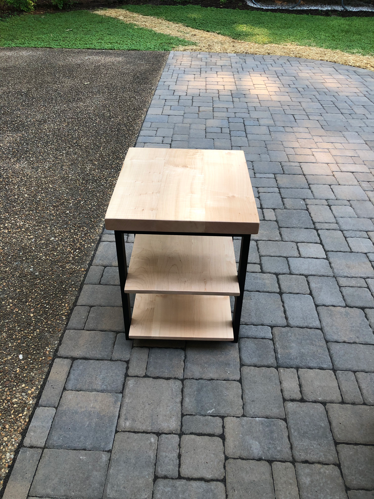
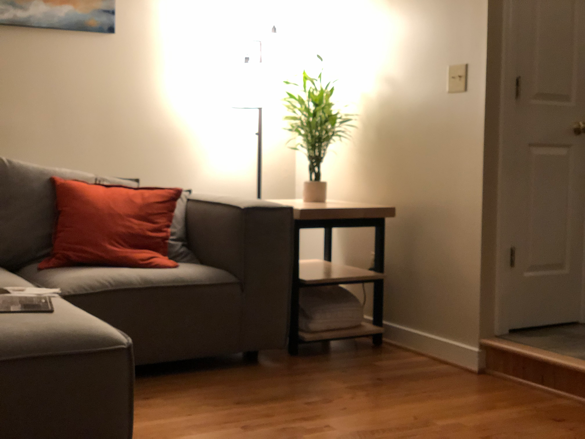

The corner by the couch needed a side table - somewhere to set a drink, hold a plant, maybe stack a few books. I had some spectacular curly maple that had been waiting for the right project.

The empty corner next to the couch was prime real estate for a side table. The existing furniture had clean lines and a modern feel, so the table needed to complement that aesthetic.

The curly maple during glue-up showed off its chatoyance - that shimmer that changes as you move around the wood. This figure is what makes curly maple so prized.

Three boards joined for the tabletop, the curl running consistently across the full width. The thick stock gave the piece its "beefy" name - this wasn't going to be some delicate accent piece.

The finished table with black ink poly legs providing contrast to the light maple. Three tiers meant plenty of storage while maintaining visual openness. The industrial-modern mix worked well.

In its new home, the table does exactly what it should - holds a plant, catches the light beautifully, and anchors the corner of the room. The curly maple earns compliments from everyone who notices it.

Building furniture for your own home hits different. Every time you walk past it, you remember the process - picking the wood, the glue-up, seeing it all come together. That connection never fades.
