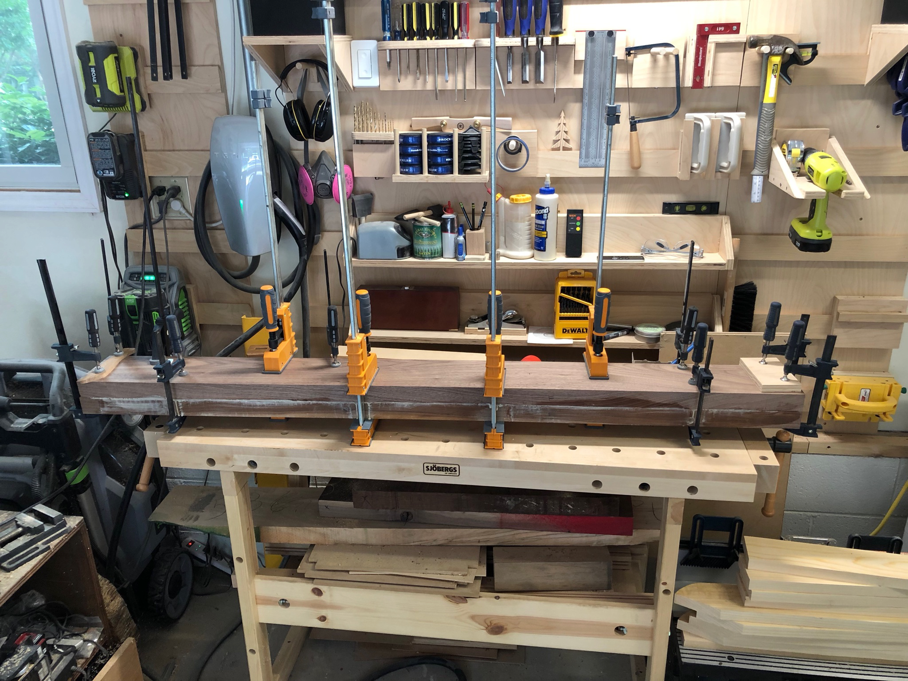
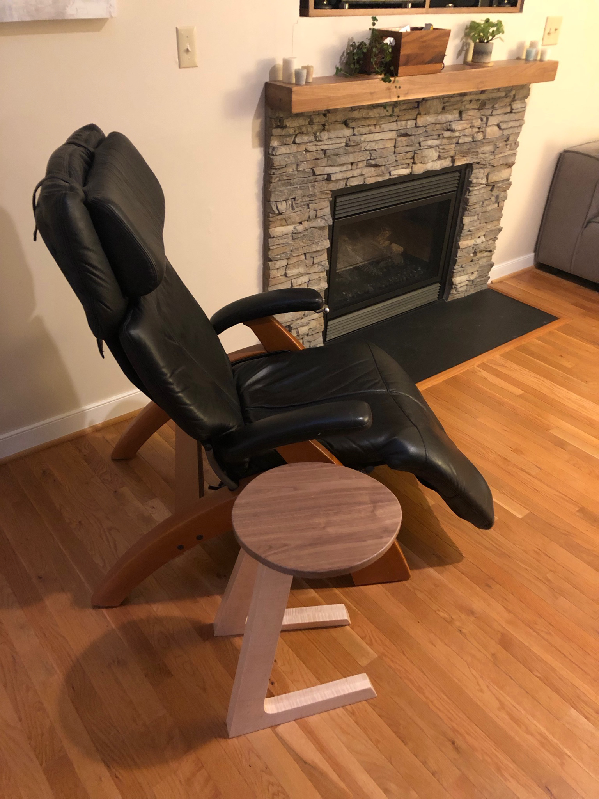

The stone fireplace was the focal point of the room, but it lacked a proper mantle. A floating walnut shelf would add warmth (figuratively) and give us a place to display photos and seasonal decorations.

Wide walnut boards were edge-joined and clamped. The grain was carefully matched so the seams would nearly disappear. Getting boards this wide and long flat and true took some patience with the jointer and planer.

The finished mantle floats above the stacked stone, mounted on a hidden french cleat. The walnut's rich brown tones complement the gray stone beautifully, and the natural edge on the front adds organic character.

A good mantle transforms a fireplace from a feature into a focal point. This one will hold stockings in winter, pumpkins in fall, and memories year-round.
