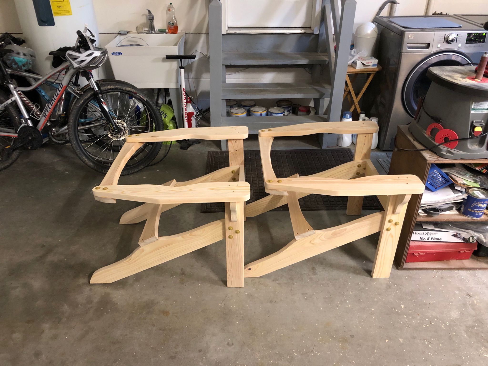
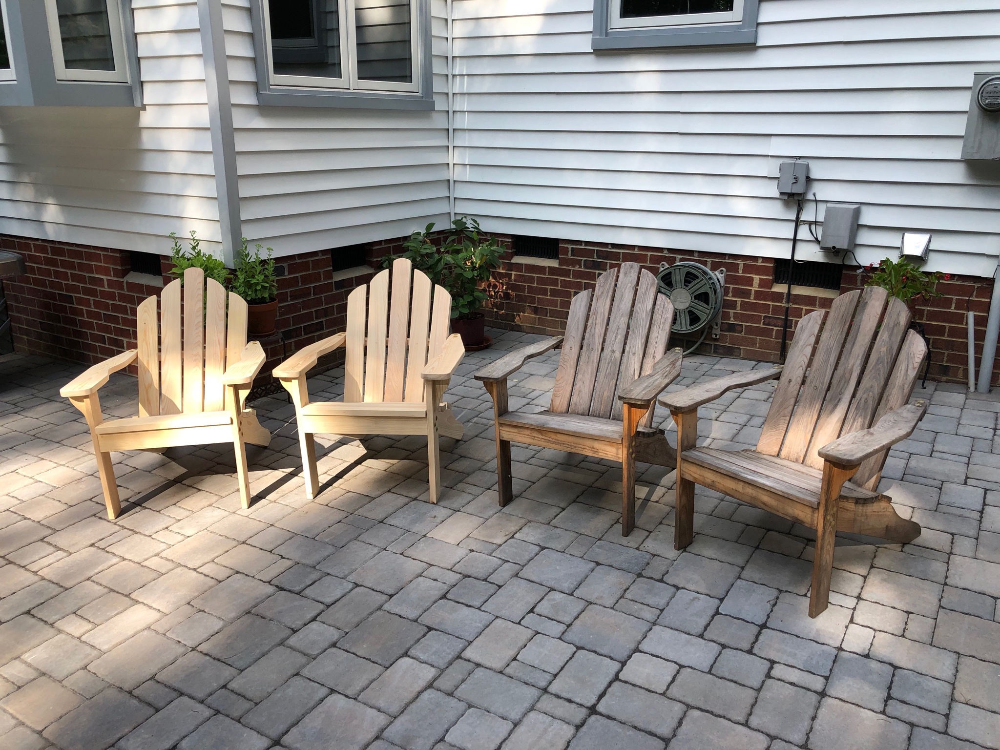

The first pair of Adirondacks had proven themselves on the patio, weathering seasons and hosting countless evening conversations. Time to double the seating capacity.

With the process already dialed in from Round 1, the frames came together quickly. Same cypress lumber, same joinery, but faster execution. That's the beauty of building the same project twice - you learn what matters and what doesn't.  And a new custom made arm jig didn't hurt either.

Four chairs now graced the patio. You can spot the age difference - the original pair on the right had developed that beautiful silvery patina that unfinished cypress gets after sun exposure. The new pair would catch up eventually.

Batch production teaches you efficiency. Setting up once and making multiple cuts, having all the hardware ready, thinking through the assembly sequence. These skills translate to every future project.

Plus now we have room for guests.
