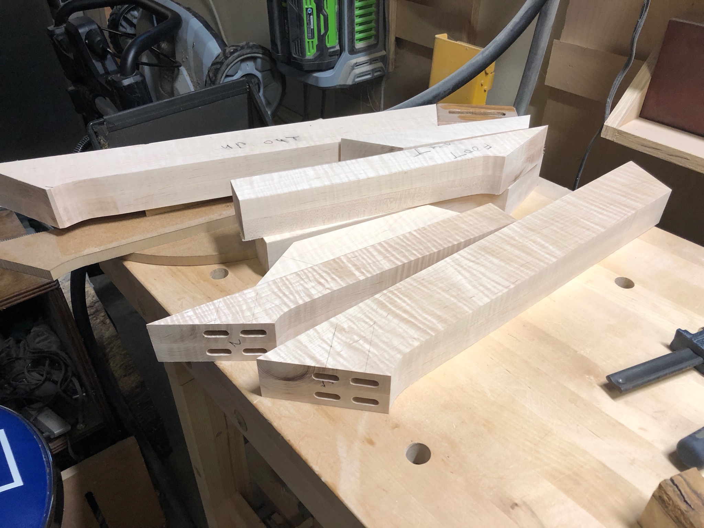
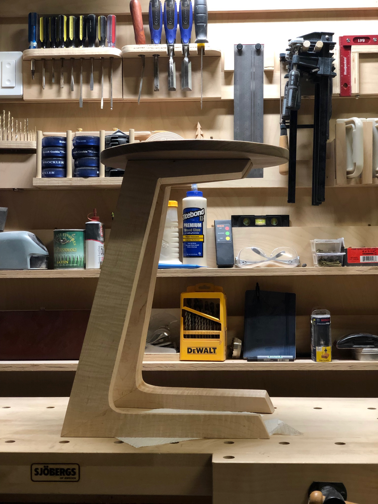
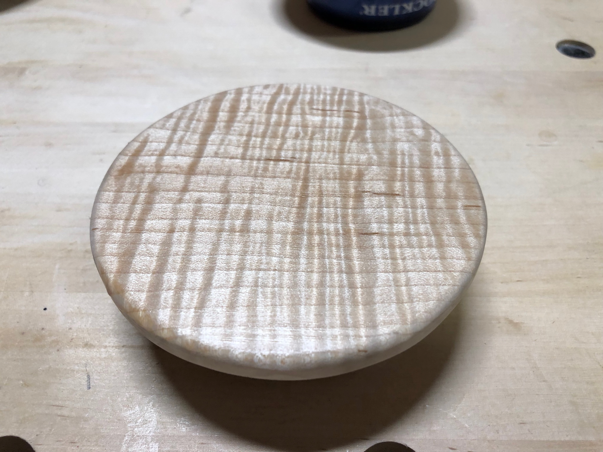
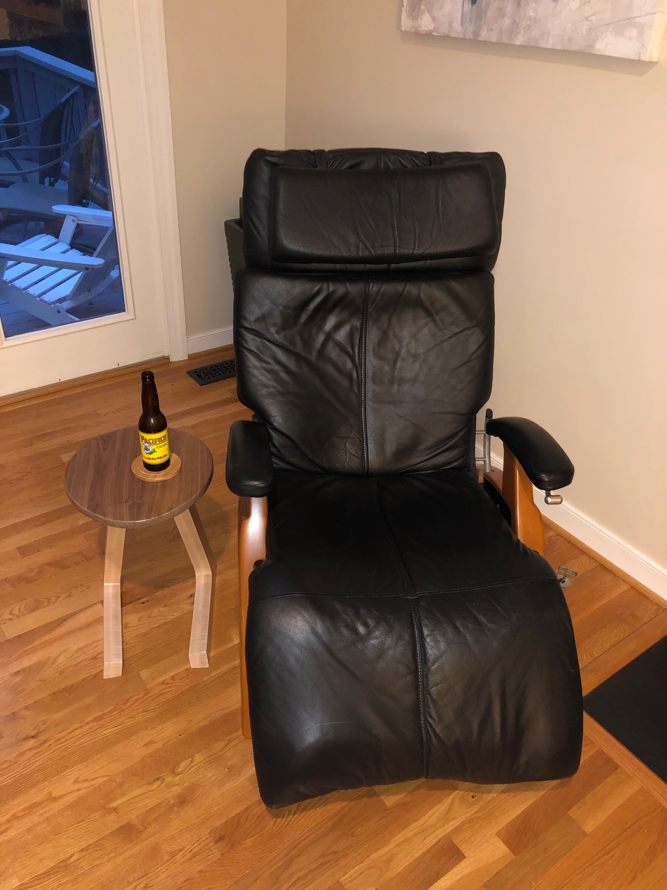

The recliner needed a companion - somewhere to set a drink while relaxing. But I wanted something more interesting than a typical side table. The design that emerged was inspired by a downhill ski racer in a tuck position.

The legs were cut from thick curly maple, with mortise and tenon joinery connecting the angled pieces. Getting the angles right while maintaining structural integrity took careful planning and test cuts.

The finished profile shows the distinctive Z-shape that gives the table its name. From the side, you can almost see the ski racer crouching for speed. The curves were refined with rasps and sandpaper until they felt right.

The circular top was cut from spectacular curly maple - that chatoyance catches light from every angle. A thick, substantial top balanced the dynamic leg design.

In its spot beside the recliner, the table does exactly what it should - holds a cold drink at the perfect height. The sculptural design sparks conversation, and the curly maple catches afternoon light beautifully.

Furniture doesn't have to be boring. A simple side table became an opportunity to explore form and function, to make something that serves its purpose while also being a small work of art.
