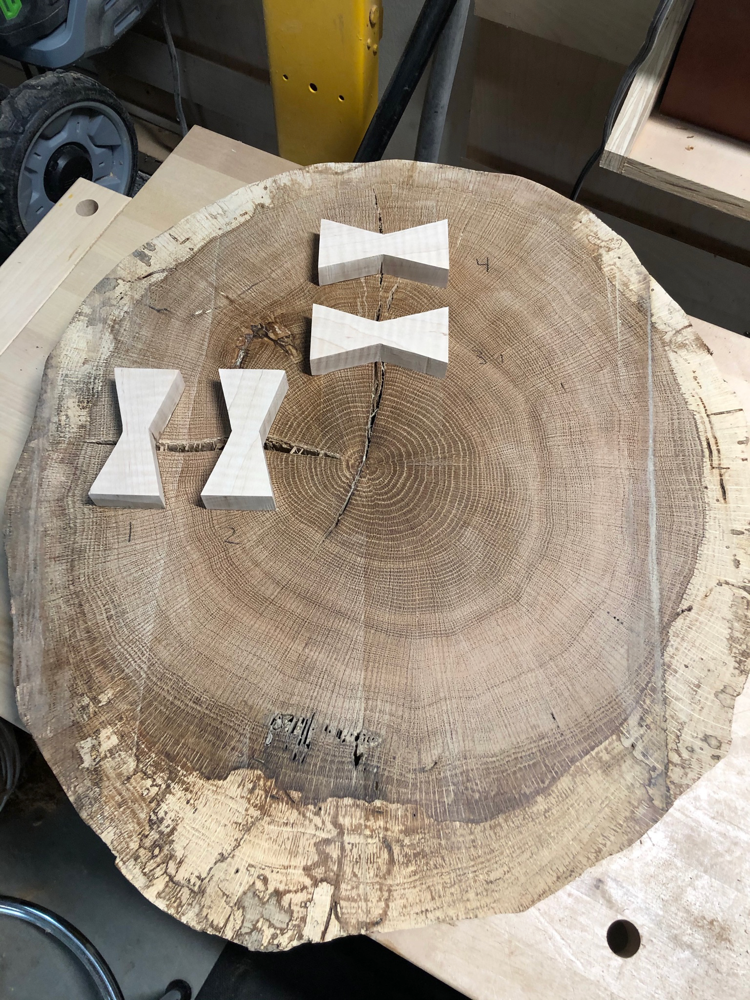
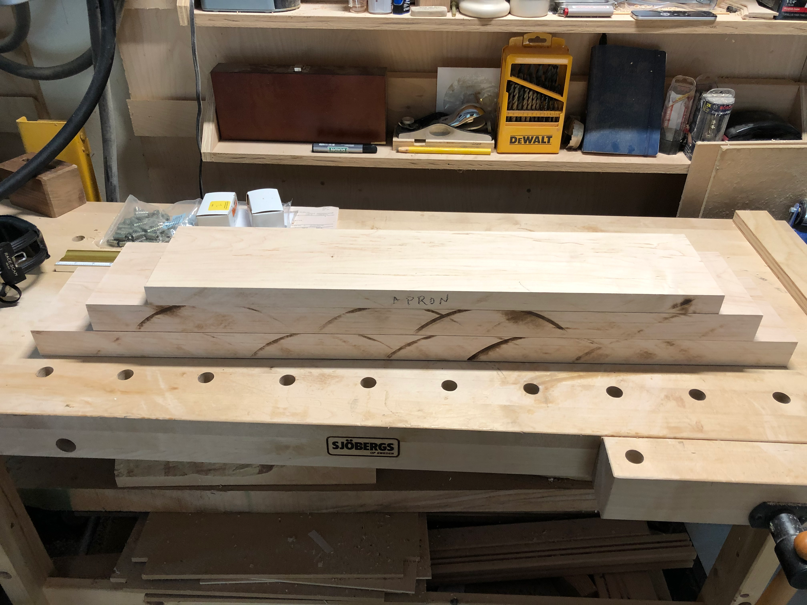
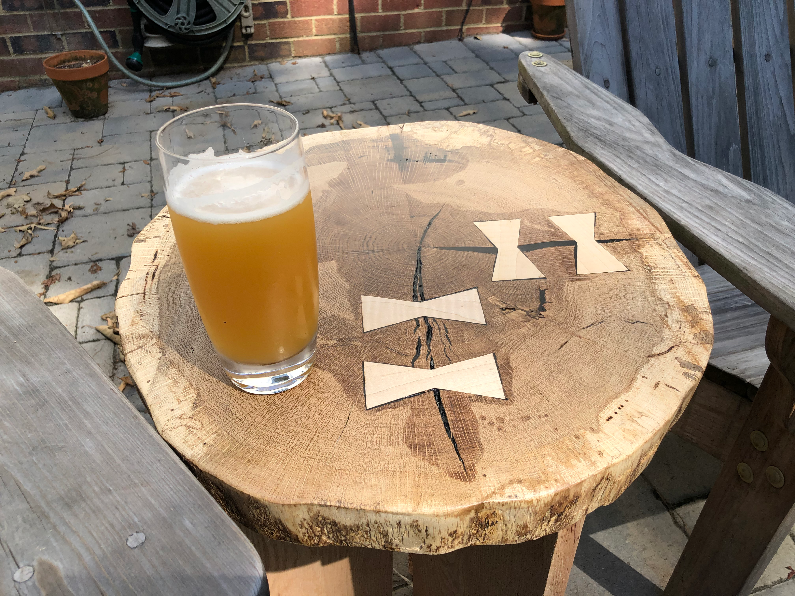

Remember those wood cookies from the neighbor's oak tree? After proper drying time, they were finally ready to become furniture. The challenge: those beautiful growth rings came with some cracks that needed addressing.

Butterfly joints - also called bowties or Dutchman joints - are the classic solution for stabilizing cracks in live-edge work. The contrasting maple keys add visual interest while mechanically preventing the crack from spreading further.

Simple legs with a slight taper would let the cookie itself be the star. The leg design needed to support the heavy oak slab while remaining visually light enough not to compete with the dramatic top.

On the patio between the Adirondacks, the cookie table found its purpose. The growth rings tell decades of the tree's story, preserved now as a useful surface. The butterfly joints have become a feature, not just a fix.

There's something deeply satisfying about salvaging wood that would have otherwise been chipped or burned. That tree spent years growing in a neighbor's yard, and now part of it lives on as furniture, holding cold drinks on summer evenings.
