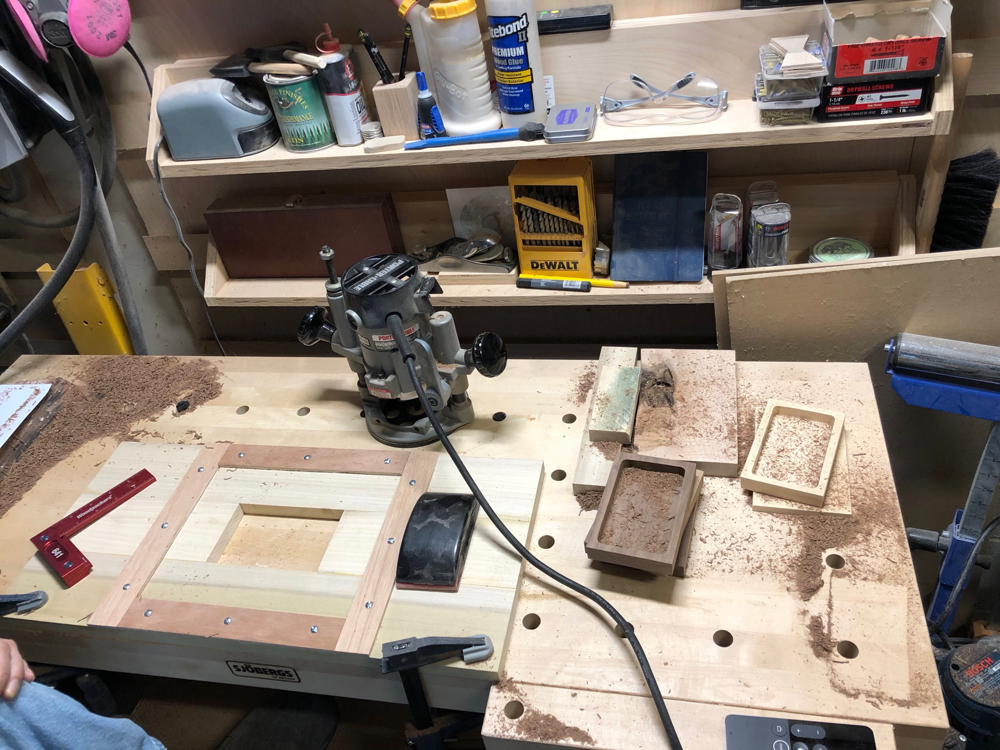
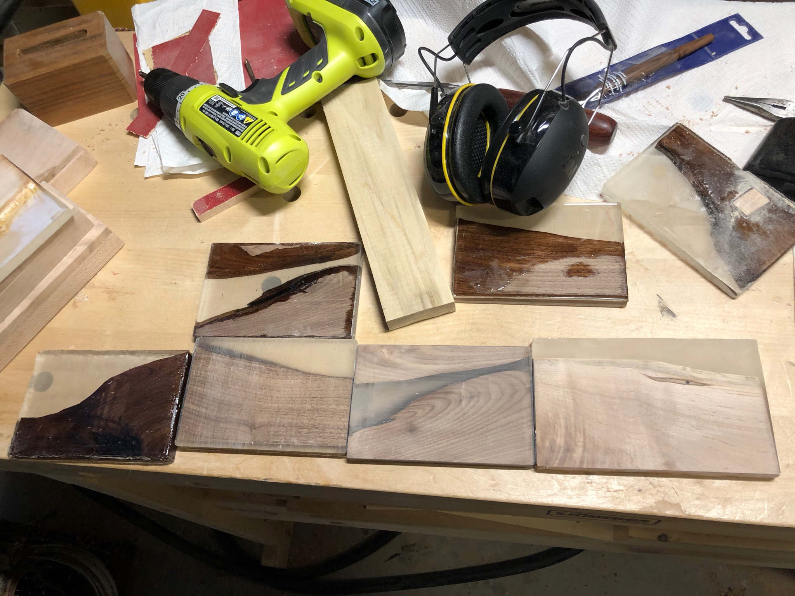
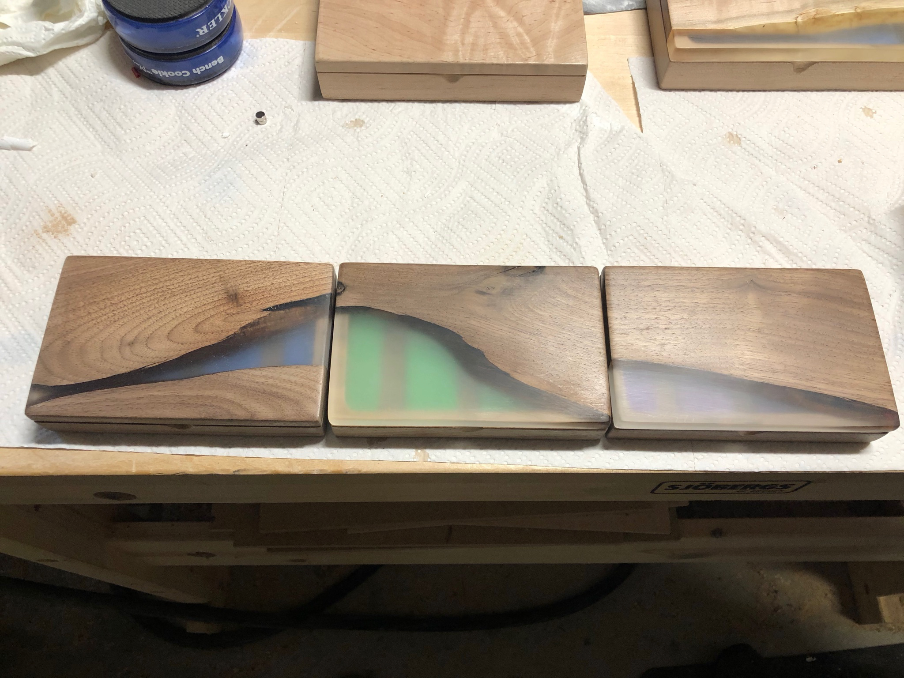
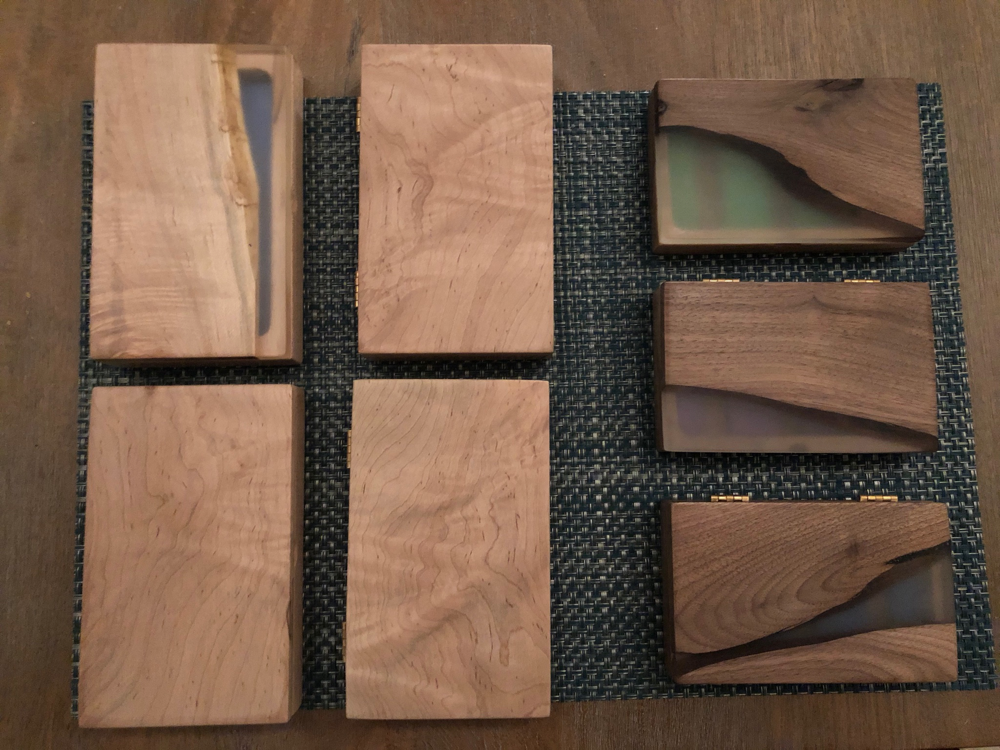
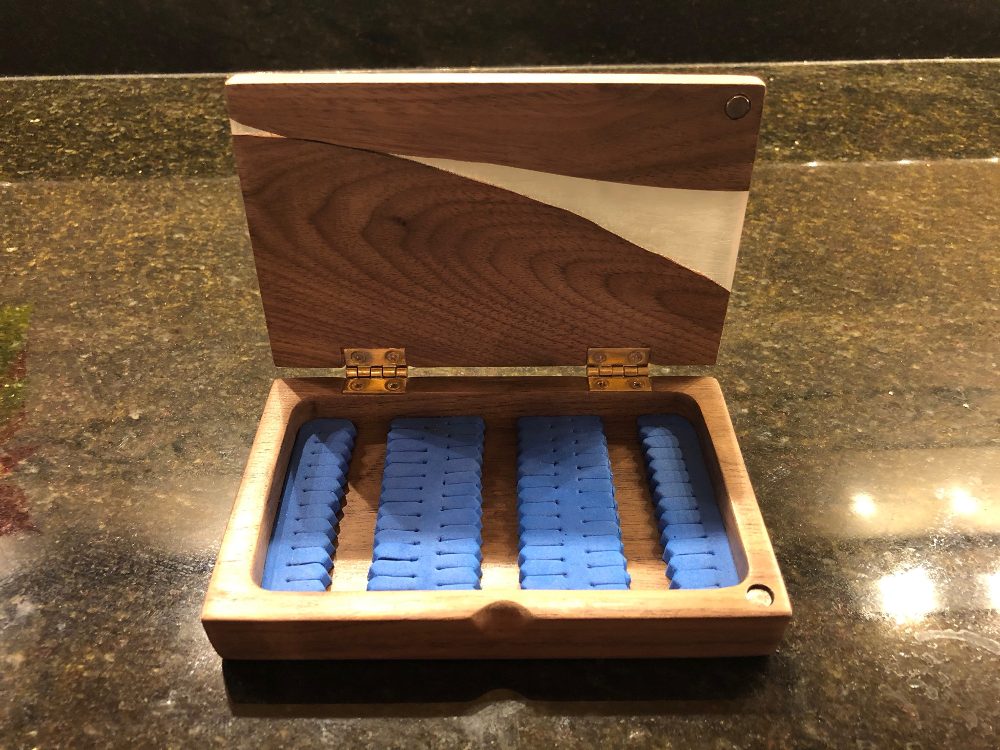

Fly fishing and woodworking share a certain meditative quality - patience, attention to detail, appreciation for natural materials. When these hobbies collide, you get fancy fly boxes.

A custom router jig ensured consistent pocket depths for the fly foam inserts. The boxes needed to be thin enough to fit in a vest pocket but sturdy enough to protect delicate flies.

The lids were where the magic happened. Walnut pieces with natural voids and live edges became canvases for epoxy river pours. Each crack and void was an opportunity for color.

Three lids showing the river table technique at miniature scale. Blue, green, and clear epoxy filled the natural voids in the walnut, creating unique patterns on each box. No two would ever be alike.

A batch of boxes ready for finishing. Some with dramatic epoxy rivers, others showcasing figured maple or clean walnut. Variety was the point - every angler has different taste.

The finished product: a walnut box with epoxy accents, brass hinges, and slit foam ready to hold flies. Magnetic closure keeps everything secure while wading in a river.

These boxes found their way to fishing friends and family members. Functional art that goes on adventures - getting wet, holding flies, developing patina over years of use. That's the kind of woodworking that feels meaningful.
