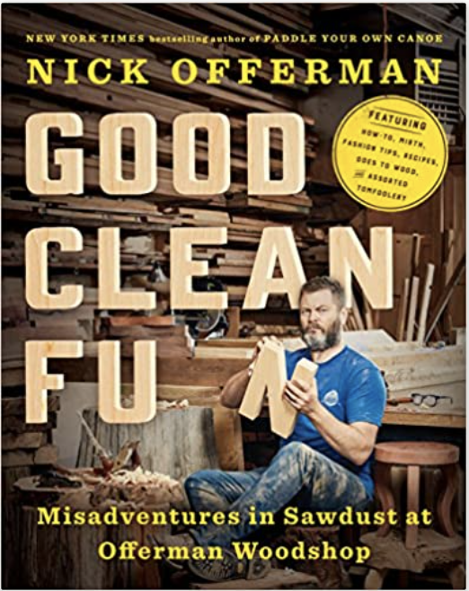

Welcome Reader,

My name is Harper Trow, and these are some stories from my forays into the world of woodworking. I hope over time there are a few stories here that will speak to you, to invite you to make things with your hands, and even if you already have some experience, to offer a few new tricks for your bag.

My path into woodworking started just a few years back in the Winter of 2016 with a certain type of itch. You see, I make custom software for a living, working in the ephemeral, conceptual world of bits all day. While this practice involves a nice mix of creativity and logical thinking, if you really think about it a certain way, all that I really produce at the of the day are a bunch of bits in a computer. The work results in pride for a job well done and happy customers, but there was something missing.

_**I began searching for a way to make things with my hands that resulted in outcomes that were more tangible. A kind of work that resulted in atoms, not bits.**_

I had enjoyed woodworking with my father when I was younger, helping him on a few projects, and it always stuck in my head as something I might want to get into one day. I just needed a space.

It was in this state of mind that I was given a book by Nick Offerman called Good Clean Fun [(link)](https://www.amazon.com/Good-Clean-Fun-Misadventures-Offerman/dp/1101984651).

It is a playful tome that exudes an obvious love for the craft and has served as a fun and thoughtful on-ramp into the art of woodworking. I cannot recommend this book highly enough; it is definately worth a read or three. Before long, I found myself dreaming of a future shop space and working on a huge list of projects that I wanted to do.

I found a group of Youtubers that have super high quality woodworking videos, pulled together a couple of other books, and my education began.
